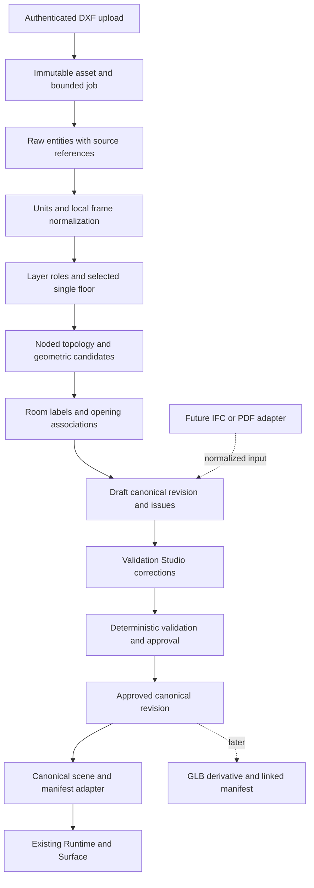

# Aether Real Estate Platform — Post-MVP 3D Next-Phase Audit

Audit date: **2026-10-05, Asia/Calcutta**. Inspection began at Git HEAD `38ebc41` with uncommitted MVP changes. At the user's request, 90 selected MVP files were committed and pushed to `dev` as `8e06387de040218b6288b9445a113e05213ea056`. The user subsequently authorized pushing the remaining application/performance work: 112 files were committed and pushed as `c1c1edcc9f268a034c3932d04594fbb13afc2a27`, now the audit's final product-source baseline. These commits record pre-existing work; they do not implement audit recommendations. **Audit only: no product source, schema, migrations, database records, or existing architectural assets were edited to fix findings.** Diagnostic scripts and synthetic probes are under `evidence/post-mvp-audit/`; transpilation/build outputs are under `.cache/post-mvp-audit-*`. Executed checks also produced tracked Python bytecode/TypeScript cache changes; these are generated artifacts, not product fixes.

Evidence terminology throughout:

- **CONFIRMED**: supported by the inspected source, asset bytes, or a fresh executed diagnostic. Source confirmation does not by itself prove a complete deployed workflow.
- **LIKELY**: a stated inference from the inspected architecture.
- **UNKNOWN**: unavailable or not reproduced in this environment.
- **RECOMMENDATION**: future work, never a description of implemented behavior.

Fresh evidence is distinguished from the prior MVP's `evidence/3d/` artifacts. Those older artifacts were inspected but are not presented as new measurements. See sections 10 and 22 for execution conditions and limits.

# 1. Executive Summary

**The imported architectural-model MVP is real and reusable, but it is not an automatic architectural reconstruction product.** The current application loads an actual IFC-derived GLB through Three.js, uses a separate renderer/runtime, isolates mapped storeys, enters IFC spaces, raycasts real geometry, and manipulates browser-local user furniture. Eight fresh geometry/navigation checks pass against the real GLB. A fresh web type check and isolated Next.js production build also pass. Browser results are recorded separately in section 10.

The key reusable achievement is a rendering boundary: `property-viewer/loadModel.ts` produces `{root, manifest}`; `Runtime.ts` owns model replacement, indexes, navigation, furniture and interaction; `Surface.ts` owns WebGL resources, cameras and lighting. A procedural producer already uses `TowerCompiler`. This is a useful foundation for a future canonical-data adapter.

The distinction is **generic loading, convention-dependent semantic interaction, sample-dependent preprocessing**. `GLTFLoader` is not coded around individual Duplex GUIDs. However, full navigation requires a sidecar manifest with correct node references, Y-up metre-space bounds and elevations, recognized semantic element types, and floor support. The sample converter explicitly recognizes A/B IFC space codes, renames two storeys, omits selected spaces, alters one roof finish, and writes to a fixed Duplex output path. It is a reproducible evaluation converter, not a builder onboarding service. Imported unit/room `nodeNames` are empty: unit choice filters rooms, not unit-owned architectural meshes.

**The largest obstacle is the CAD interpretation/data contract, not lack of a prettier renderer.** Fresh diagnostics establish:

1. `CADParser.parse()` calls `entity.flattening()` on `LWPOLYLINE` and `POLYLINE`. Both fail in the available ezdxf environment and produce zero wall segments for otherwise valid closed rectangular polylines.
2. `$INSUNITS` is ignored. Identical coordinates tagged metres versus millimetres emit identical geometry values.
3. A partition ending at two wall interiors remains disconnected in the endpoint-only graph: a two-room rectangle becomes one detected room.
4. Real polygon geometry is discarded when detected rooms become bounding rectangles. The compiler centers those rectangles on `room.node`, which can differ from the bounding-box center.
5. Door-line midpoints are emitted as `startOffset`; the compiler treats them as opening starts. A source span `[1,2]` becomes a generated opening `[1.5,2.5]`.
6. PDF processing fabricates doors; its no-room fallback emits four walls missing `endZ`. A safe blank-image diagnostic reproduces this without opening an external file or calling an AI service.
7. `TwinsService.parseFloorplan()` saves parsed geometry in `GeneratedStructure.structureJson`, while builder polling loads `FloorPlan.layoutData` and initializes the editor from it. The parser result is not copied there or fetched by that polling flow.
8. Floor/model/inventory controllers lack JWT guards and accept tenant IDs supplied through headers. Tenant-filtered SQL alone does not establish authenticated tenant ownership.

Sources: [parser.py](apps/ai-service/parser.py), [geometry.py](apps/ai-service/geometry.py), [pdf_processor.py](apps/ai-service/pdf_processor.py), [twins.service.ts](apps/api/src/services/twins.service.ts), [builder editor](apps/builder/src/app/(dashboard)/ai-generator/page.tsx), [tenant interceptor](apps/api/src/interceptors/tenant.interceptor.ts), and fresh [diagnostics](evidence/post-mvp-audit/diagnostics.json), [PDF probe](evidence/post-mvp-audit/pdf-fallback.json).

**RECOMMENDATION:** one genuine, licensed, clean layered DXF of one bungalow/apartment floor; calibrated units and local coordinates; source-preserving extraction; deterministic wall/topology reconstruction; retained room polygons; host-associated openings; coherent human corrections; a versioned canonical revision; a scene/manifest adapter into the existing runtime. Do not promise arbitrary messy DXF, IFC, PDF, DWG, multi-tower inference or photorealistic automation in that milestone.

## 1.1 Documentation reviewed and claims reconciled

Relevant existing documents were read before final conclusions: `docs/3d/PROJECT_3D_MASTER_AUDIT.md`, root `3D_MVP_IMPLEMENTATION.md`, `3D_MVP_PERFORMANCE_REPORT.md`, `3D_MVP_TEST_REPORT.md`, `3D_MVP_MANUAL_TEST_GUIDE.md`; model `SOURCE.md`/`ATTRIBUTION.md`; environment attribution; `docs/MD/AI_DIGITAL_TWIN_ENGINE.md`, `PHASE_04_DIGITAL_TWIN_PLATFORM.md`, `PHASE_07_AI_PLAN_PROCESSING.md`, `PHASE_08_AI_3D_GENERATION.md`, `PHASE_11_AI_CAD_TO_3D_CONVERSION_AND_EDITOR.md`, `MASTER_TECHNICAL_ARCHITECTURE.md`, and `UPDATED_PHASE_WISE_ROADMAP.md`. The manifest, conversion program, diagnostics and test scripts were inspected directly. No standalone parser/scene-compiler operational manual was found beyond these documents and source comments.

| Claim | Current finding |
|---|---|
| Old master audit: no GLB loading | Superseded: actual `GLTFLoader.parseAsync()` exists and the real bundled GLB passes fresh tests. |
| MVP: shared renderer and semantic indexes | Confirmed in `Surface`, `Runtime`, `SceneIndex` and the legacy effect/cache implementation; indexed candidate scans still occur during movement. |
| MVP: browser-local furniture, stairs disabled | Accurate limitations, explicitly exposed in code and UI. No server furniture endpoint exists. |
| Old audit: production DXF/polyline/OCR/PDF support is working | Overstated. LINE fixtures run; polylines fail; absent DXF text goes to filename templates; PDF doors are guessed. |
| Planning documents: queues, YOLO/Detectron2, normalized hierarchy, GLB exports, QA approval | Plans rather than the current implementation. No such operational CAD generation system was located. |
| Phase 11: old `building.glb`/`floor_walkthrough.glb` prove architectural loading | Those files are small synthetic assets. The new importer can load supported GLBs; the legacy path still procedurally generates its content. |
| Old audit: a 260 m ground plane is inherently a triangle bottleneck | Incorrect premise: an unsubdivided `PlaneGeometry` is two triangles. Diagnose draws, materials, shadows and scene complexity instead. |
| Old audit: background color overrides a sky mesh; predicted percentage gains | Not evidence. A scene clear color does not prevent visible geometry rendering; no old estimated performance percentage is adopted. |

## 1.2 Change attribution and file-by-file inventory

**CONFIRMED at inspection start:** the latest commits were older Phase 7/Phase 3–4 work, and `git diff HEAD` mixed MVP and portal/theme/performance edits. The subsequent user-authorized MVP commit is `8e06387` (90 files). Initial before/after comparisons below use `38ebc41`, not the new HEAD. Untracked files had no committed before-image. Do not describe all initial working-tree changes as authored in the MVP. Saved evidence: [initial status](evidence/post-mvp-audit/git-status-before.txt), [tracked change counts](evidence/post-mvp-audit/git-diff-numstat.txt). No tracked deletions were present in the initial status.

After that push, Git lists **155 pending files** using `git status --porcelain --untracked-files=all`: 30 audit report/diagnostic files, 79 remaining application code/media files, 30 earlier performance-work files, 8 generated bytecode/TypeScript caches, and 8 other scripts/root configuration files. This is a snapshot, not a permanent count: further audit artifacts change it. The 79 application files and earlier performance work were not authored as audit fixes. The audit report/evidence remain local; no blanket commit or cleanup was performed.

The user's subsequent application/performance push includes the 79 application files, the earlier performance report/evidence/tooling, root dev command and review scripts (112 files total). Fresh admin/builder TypeScript checks and isolated production builds passed; API TypeScript compilation also passed. Product changes are therefore committed at `c1c1edc`. The remaining local changes are the audit report/diagnostics, 8 generated caches and 5 existing scratch files; they are not missing application updates.

In the table, “prototype” describes the inspected scope/contract, not whether the code is useless. “Reusable” is not a claim of production release readiness.

| File | Before → current responsibility; important additions | Removed/preserved behavior and compatibility | Debt / quality / attribution |
|---|---|---|---|
| `apps/web/src/components/building-viewer.tsx` | Procedural monolith → public dispatcher plus retained legacy viewer. `BuildingViewer` filters `initialModels` for GLB/GLTF; `LegacyBuildingViewer` uses `Surface`, `SceneIndex`, content caches and live state refs. | Existing props/export preserved. Imported floor indexes differ from database floor numbers. Advanced imported tours/hotspots/inventory are not supplied by the dispatcher. | Mixed reusable repairs and large prototype component. Full HEAD diff is 1,311 additions/438 deletions, not an isolated MVP patch. |
| `property-viewer/Surface.ts` | New: renderer/cameras/controls, `quality`, `resize`, deferred HDR/PMREM, `record`, `stats`, `dispose`. | Renderer ownership removed from repeated legacy initialization; no new render loop here. | Reusable; fixed shadow volume/camera far plane and app-specific HDR URL. |
| `property-viewer/loadModel.ts` | New: GLB/GLTF streaming, URL validation, abort checks, procedural `TowerCompiler` producer, manifest generation. | Makes actual `modelUrl` meaningful. Existing procedural pipeline retained. | Prototype import contract: main-body limit only, no codecs, default ten floors for bare layout, no general origin/up-axis inference. |
| `property-viewer/model.ts` | New: `Manifest`, `ModelSource`, `validateManifest`, `SceneIndex`, `disposeTree`, `visible`, `sampleSource`. | Adds sidecar semantics without adding a DB column. | Reusable boundary, incomplete validation and IFC-oriented type allowlist. Copy-on-append index arrays add build costs. |
| `property-viewer/Runtime.ts` | New: one RAF, `load/unload`, generation guard, visibility, camera framing, room teleports, input, user-furniture actions, diagnostic snapshot. | Source replacement affects subtree rather than renderer. Doors open by hiding assemblies. | Prototype navigation/interaction, not physics or topological pathfinding. |
| `property-viewer/Navigation.ts` | New: cached obstacle AABBs, `ground`, `fits`, `move`, `placementClear`; triangle rays/body probes. | Replaces full-scene movement traversal in imported path. | Useful MVP controller; scans collider arrays, no BVH/navmesh, stairs or furniture obstacles. |
| `property-viewer/Furniture.ts` | New: placements, factory reuse, transform validation, UUIDs, local save/restore/delete/reset. | Editable user furniture is separate from immutable source furniture. | Reusable interaction; room AABBs, local-only persistence, no revision hash or tenant-user identity. |
| `property-viewer/PropertyExperience.tsx` | New: imported controls, sources, external-navigation bridge, error/loading/metrics UI, reproducible DXF routes. | No full advanced legacy feature parity claimed. | Prototype/demo defaults, source identity can trigger reload, model discovery has no persisted manifest field. |
| `components/explorer-route.tsx`, `app/explorer/page.tsx` | Explorer content moved behind route selection/dynamic import; default imported experience, `?legacy=1` retained. | Advanced procedural route remains accessible. | Reusable routing; demo is default and project-query handoff is incomplete. |
| `components/legacy-explorer.tsx` | New file holding advanced explorer UI formerly in page. | Preserves floor controls, viewer integration, tours/shortlisting controls. | Hardcoded ten floor labels/unit descriptions remain. |
| `components/default-layout.ts` | New shared demo procedural layout. | Makes procedural sample independently loadable. | Sample-specific; never substitute as parsed production data. |
| `scene-compiler/SceneCompiler.ts` | Walls/floors/apertures producer retained; wall opening cells, merged visual walls/separate colliders, richer floor materials and hinge assemblies. | Solid wall behavior replaced with rectangular voids; public constructor/`compile()` retained. | Reusable primitives, rectangular rooms/joints/semantic tagging remain unsuitable for faithful arbitrary plans. Diff includes broader finish changes. |
| `scene-compiler/TowerCompiler.ts` | Stacking retained; `TowerCompilationResult`, `floorNumberMap`, bounds, added decorative piers, ceiling-tagged slabs. | Keeps `height + 0.25` cumulative elevations. | Prototype building assumptions: uniform bounding slabs, four invented corner piers, foundation/parapet. |
| `scene-compiler/TextureGenerator.ts` | Untracked cached canvas material maps. | Current compiler shares texture objects rather than creating maps per room. | Reusable cache; unseeded patterns, fixed repeats, no calibrated PBR surface maps. |
| `scene-compiler/FurnitureFactory.ts` | Existing catalog significantly enlarged/refined; singleton material library marks shared ownership. | Existing `create(type,color)` API retained. | Useful catalog; many meshes, transmission glass remains, type/size defaults. Cannot attribute every change to MVP. |
| `scene-compiler/AutoPlacer.ts` | Room-name rules retained; lift/stair/lobby rules added in HEAD diff. | Continues fallback for empty furniture arrays. | Decorative prototype, no clearance/collision optimization. |
| `scene-compiler/ExteriorGenerator.ts` | Environment/shell producer rewritten substantially; cached sky and richer exterior. | Existing compile input retained. | Decorative synthetic facade; transmission and many meshes remain. Not CAD-derived elevation reconstruction. |
| `tools/3d/prepare_duplex.py` | New offline IFC tessellation/export and semantic sidecar generation. | No online IFC import/API implementation. | Sample-specific; source choice/unit code mapping/finish policies need manual design before generalization. |
| `apps/web/public/models/duplex/{duplex.glb,manifest.json,SOURCE.md,ATTRIBUTION.md}` | New real BIM-derived evaluation asset and metadata/license. | Old synthetic GLBs retained. | Good licensed regression fixture; only one real architecture source. |
| `apps/web/public/models/dxf-fixture.json` | New serialized parser fixture. | Viewer fixtures avoid API/DB and repeat levels explicitly. | Rendering regression, not upload/reconstruction accuracy proof. |
| `apps/web/public/environments/{venice_sunset_1k.hdr,ATTRIBUTION.md}` | New licensed IBL asset. | Daylight fallback remains on HDR failure. | Reusable lighting asset, fixed application URL. |
| `tools/3d/*`, `evidence/3d/*`, root MVP reports | New tests, staged build/benchmarks, screenshots and reports. | Historical baseline retained separately. | Useful but outside a normal test runner; some scripts overwrite evidence or a product fixture if rerun unchanged. |
| `apps/api/src/controllers/floorplan.controller.ts` | Upload/analyze/layout/split endpoints preserved; HEAD diff replaces old apartment templates with Ground/Type A/B/C lookup content. | Old type selectors can map differently now; payment/twin calls still seed templates. | Sample templates, not inference. Concurrent change attribution unknown. |
| `apps/api/src/controllers/inventory.controller.ts` | Inventory floor/flat APIs retained; filters/current structure lookup touched. | Current floor route joins saved structures; no canonical revision contract. | Tenant identity/auth and ambiguous latest structure remain. |
| `apps/builder/src/app/(dashboard)/ai-generator/page.tsx` | Existing upload/editor/custom preview retained with substantial uncommitted UI changes. | Does not use new `Runtime`; generation progress remains timed text. | Prototype workflow; parser/editor persistence divergence. MVP provenance unknown. |
| `generate_test_dxf.py`, service DXF copy | Synthetic generator changed to three-unit plan; root file is not its current equivalent. | Filename still says ten floors, contents do not encode ten storeys. | Useful synthetic checks, misleading architectural realism/name. |

The repository also has tracked changes to API startup/tenant resolution/navigation/pages/seed/package configuration; admin/builder auth/dashboard/theme files; consumer inventory/location/gallery/layout/rendering files; `.gitignore`, `package.json` and build metadata. Untracked image/video folders, performance scripts/reports, `scratch/`, and review tools are outside a reliably attributable 3D-MVP patch. The complete path/count inventory is preserved in the two evidence files above rather than silently claiming these unrelated edits as 3D work.

Preserved source with no textual HEAD changes includes `apps/ai-service/{parser,geometry,main,ocr,pdf_processor,style}.py`, DXF utility and core twin/entity files. Tracked Python bytecode was already modified before this audit; diagnostics disable bytecode writes.

# 2. MVP Verification Scorecard

Statuses apply to the stated capability and explicitly scoped implementation. They do not mean arbitrary architectural inputs work. No completion percentage is calculated.

| Previous MVP capability | Classification | Code/runtime evidence | Boundary |
|---|---|---|---|
| Real architectural GLB loads | **VERIFIED** | `loadModel.ts:12`, `GLTFLoader.parseAsync`; real binary plus fresh `core-tests.json`. | One real model; plain GLB/GLTF; no Draco/Meshopt/KTX2 decoder setup. |
| Correct orientation/scale | **VERIFIED** for bundled sample | `prepare_duplex.py:32` transforms `[X,Y,Z]→[X,Z,-Y]`; source hash/metre bounds independently checked. | General GLBs must already be Y-up, with metre/millimetre manifest contract; no auto-detection. |
| Exterior inspection | **VERIFIED** | `Runtime.frame/view`, `OrbitControls`; actual browser camera/reset assertions. | Clip/shadow constants limit large/off-origin models. |
| Floor isolation | **VERIFIED** for mapped sample | `Runtime.selectFloor/applyVisibility`, manifest storeys/node refs; real geometry visibility tests. | Requires semantic floor membership; retains supporting IFC slabs through a ±0.25 m heuristic. |
| Flat/room mapping | **PARTIAL** | 18 spaces grouped into A/B on two inhabited storeys; selectors work. Fresh `SceneIndex.byRoom/byFlat` both size zero. | Room groups/spawns are useful; unit-owned mesh isolation, DB-flat linkage and room polygons absent. |
| First-person walkthrough | **PARTIAL** | `Runtime.enter`, keyboard/pointer lock/drag look, human eye height; fresh geometry checks. | Teleports between rooms; floor selector for levels; no stair traversal or route graph. |
| Collision | **PARTIAL** | `Navigation.fits/move`; wall stopping and real opening reachability pass. | Static type-filtered triangle probes; generated windows unindexed; source and user furniture not movement obstacles. |
| Furniture placement | **PARTIAL** | `Furniture.add/valid` floor rays, bounds, wall/user-object AABBs. | Three types, rectangle/box containment, no true room footprint or door clearance optimization. |
| Furniture movement/rotation | **VERIFIED** | `Furniture.transform`, Runtime mouse placement/45° rotation/reset/delete; actual transform browser assertions. | No TransformControls/general asset importer; UI commands rather than full CAD manipulation. |
| Furniture persistence | **PARTIAL** | `Furniture.save/restore` version 1, source/project browser key and transform checks; refresh test. | Browser-local only; no shared/server storage, revision migration or user authorization. |
| Performance repair | **PARTIAL** | Persistent Surface, cached geometry/indexes, subtree disposal; historical and fresh measurements separated below. | Thousands of legacy draws remain; transmission still elsewhere; no broad device or moving-camera release proof. |
| Existing DXF pipeline preserved | **PARTIAL** | Fresh LINE fixture parsing and explicit single/ten-repeat rendering path. | Polyline extraction broken, topology/unit errors, backend/editor data handoff incomplete; no end-to-end production upload certification. |

Beyond the 12 MVP items: production IFC upload **NOT IMPLEMENTED**; automatic DXF→GLB export **NOT IMPLEMENTED**; generic unit mesh mapping **NOT IMPLEMENTED**; timed builder generation/reachability logs **MOCK**; polyline extraction and PDF no-room wall payload **BROKEN** in fresh diagnostics; physical mobile QA and real tenant/database flow **UNVERIFIED**.

Preserved advanced legacy capabilities are **PARTIAL** in the fresh regression: dollhouse/floorplan renderer stability and hotspot mounting pass; startup building-cache stability, tour pause and door-click animation assertions fail. This does not invalidate the 13 passing imported-runtime checks, but it prevents claiming complete fresh advanced-viewer certification. See section 10.4 for the failure context.

# 3. Post-MVP Architecture

## 3.1 Actual runtime/data flow

```text
Plain GLB/GLTF URL + optional manifest URL
    └─ loadModel: fetch / stream / GLTFLoader / limited scale validation ─┐
                                                                      │
Legacy structureJson + explicit floors                                 │
    └─ loadModel: TowerCompiler → SceneCompiler → auto furniture ───────┤
                                                                      v
                                           { Three.Group root, Manifest v1 }
                                                                      |
                                Runtime.load → SceneIndex → Navigation
                                                                      |
                  Surface (renderer/cameras/controls/light/HDR/resize)  |
                                ^                                     v
                   one Runtime RAF ← visibility / input / camera / furniture
                                                                      |
                                        Furniture save/restore → localStorage

Parallel preserved ADVANCED path:
LegacyExplorer → BuildingViewer → LegacyBuildingViewer
    ├─ API inventory / templates / authorized-or-header-scoped records
    ├─ TowerCompiler / SceneCompiler / ExteriorGenerator
    ├─ visited representation cache + SceneIndex + shared Surface
    └─ one legacy RAF; GSAP modes/tours/doors; 10 Hz minimap/hotspot updates

Builder editor has a THIRD rendering implementation:
ai-generator/page.tsx → inline Three geometry/preview
    (not the consumer Runtime and not the canonical scene compiler)
```

## 3.2 Layer contracts and coupling

| Layer | Files/functions | Input → output/data | Coupling and responsibility | Current limit |
|---|---|---|---|---|
| Source/UI | `PropertyExperience`, `ModelSource` | URLs or `layout/floors` → selected source | Discovers model records, includes sample/fixture sources | Demo defaults and no persisted manifest revision |
| Imported production | `loadModel` | bytes + manifest → Three.Group + validated manifest | Fetch/progress/abort/plain glTF loader; units scale | No source architecture interpretation, codecs, local rebasing or complete external resource limits |
| Procedural production | `TowerCompiler.compile`, `SceneCompiler.compile` | floor configs + untyped JSON → generated groups/maps | Architectural primitives and decorative fallback | Rectangles, hardcoded structural extras and browser DOM materials |
| Semantics | `Manifest`, `validateManifest` | sidecar graph → validated fields/node refs | World metre-space camera/bounds contract | No topology/provenance/revision/schema for CAD |
| Indexing | `SceneIndex` | root + manifest → meshes/walls/floors/ceilings/doors and Maps | Traverses at load/content changes, inherits memberships | IFC allowlist; generated parent semantic type incompletely inherited; empty sample room/unit mesh maps |
| Rendering | `Surface` | container + scene → canvas and renderer stats | Controls, HDR, resize and disposal; no RAF | Fixed spatial assumptions, application-lifetime shared caches |
| Model lifecycle | `Runtime.load/clearModel/unload/dispose` | source → loaded subtree or recoverable error | Generation counters prevent stale attachments; render-list cleanup | External loader subrequests only partly abortable; compiler work synchronous |
| Navigation | `Navigation` | indexed meshes + floor elevation → grounded positions | Static AABBs and ray probes | No semantic graph/physics/BVH/stairs |
| Interaction | `Runtime` | keyboard/mouse/touch/UI → mode/camera/actions | Exterior/floor/walkthrough states, door visibility | Global door state, room teleports |
| Furniture | `Furniture` + factory | placement records → Three objects | Ground and conservative transform checks | Authored furniture immutable; no clearance/reachability model |
| Persistence | `Furniture.save/restore`; API JSONB separately | transforms → local browser storage | Version/model ID/URL checks | Not server persistence; unchanged URL can conceal a changed model revision |

**CONFIRMED:** rendering is substantially separated from imported model preparation. `Surface` has no CAD parsing. **PARTIAL:** semantic adaptation and procedural generation still use `any`; the procedural compiler mixes architectural geometry with decorative furniture, tower piers and room-name material rules. Legacy and builder rendering are not unified. A new canonical adapter is feasible; moving CAD inference into `Runtime` would undo the separation.

## 3.3 General versus sample-specific behavior

| Behavior | Classification | Evidence / another builder's requirement |
|---|---|---|
| Plain GLB/GLTF parsing/material loading | Generic within loader limits | Supported HTTP(S), correct CORS, browser-readable URLs, uncompressed resources and accepted external suffixes. |
| Exterior camera fit | Generic but bounded | `Runtime.frame` derives bounds; far=500/default shadow volume still assumes modest scene extents. |
| Scale/up-axis | Convention-dependent | Manifest `units` is metres or millimetres, upAxis must be Y; all semantic coordinates already world metres. |
| Storey isolation/support | Convention-dependent | Actual scene node membership and recognizable floor semantics; slab elevations must match selected floor. |
| Walls/doors/ceilings | Convention-dependent | Export manifest element types supported by `SceneIndex`, or generated per-mesh userData; arbitrary exporter naming alone is insufficient. |
| Rooms/spawns | Convention-dependent | Valid globally unique room IDs, bounds, usable standing points, mapped floor elevations and floor geometry. |
| IFC sample A/B units | Sample-dependent | Converter uses first character of `IfcSpace.Name`, excluding names `stair`/`room`; another project needs a different unit-association rule. |
| Source/output/model ID | Sample-dependent | Fixed `/models/duplex/`, `bsi-duplex-v1`, `demo-duplex`; converter is not a project/tenant asset service. |
| Procedural bare layout | Sample-dependent fallback | Default ten repeated levels, 3 m height, synthetic piers/foundation/parapet; supply explicit floors to avoid invention. |
| Legacy cameras/walking bounds | Sample-dependent defaults | Fixed exterior `(40,25,45)`, ±25 movement clamp, several `activeFloor*3.2` paths, ten UI levels. |

Another builder can use exterior inspection immediately after preparing a supported GLB. Full room-level use requires semantic sidecar authoring or an exporter that creates it, calibrated transforms and elevations, standing-position QA, compatible collider types, licensing and readable asset URLs. None of this is automatically generated for arbitrary uploads today.

# 4. Current Imported Model Pipeline

```text
buildingSMART Duplex_A_20110907.ifc
  ── Manual: select/download/check license and legitimate IFC source
  ── Manual: configure sample policies, dependencies and CLI invocation
  ── Automatic for this sample: IfcOpenShell tessellates IfcProduct world geometry
  ── Automatic: [X,Y,Z]→[X,Z,-Y], partition per product/material, sharp normals
  ── Automatic with manually authored policies: presentation material adjustments
  ── Automatic: trimesh uncompressed GLB export
  ── Semi-automatic: IFC storeys/spaces + explicit A/B code rule → manifest
  ── Manual: license/attribution packaging, independent inspection and navigation QA
  ── Automatic: static browser download → GLTFLoader → indexes → viewer
```

Entry point: [prepare_duplex.py](tools/3d/prepare_duplex.py), not an API. Legitimate retained source: `.cache/Duplex_A_20110907.ifc`, 2,380,763 bytes; SHA-256 `b347a2c8aa8fff6db896a4417a9c50c22ac0ccd7c5cfc22b99b8d29336c606ed`. Fresh diagnostic verifies header and hash. Bundled GLB: 2,051,496 bytes; SHA-256 `53a8e89b6ebd12fb6b471a84e56df8f47514be7b43d49242c055ec22c1d708ed`; 277 meshes, 278 nodes including root, 26,348 triangles, 21 materials, no images or compression extensions. Source tessellation bounds previously independently inspected: approximately `[-0.2415,-1.55,-4.3827]` to `[9.0415,6.6348,22.1827]` metres.

| Conversion concern | Actual behavior |
|---|---|
| Software | IfcOpenShell 0.8.5 and trimesh 4.11.5 in retained BIM environment; dependencies inspected. |
| Settings | `USE_WORLD_COORDS=True`, `WELD_VERTICES=True`; all represented products except sites/opening solids considered; spaces retained only as metadata. |
| Scale/orientation | Geometry converted to Y-up; no recentering. Converter assumes its space/storey elevations are consistent with tessellation metres; general IFC unit handling has not been proven. |
| Openings | Real IFC voids tessellated by IfcOpenShell; not recreated by a custom wall boolean engine. |
| Merging | Partition faces by original surface style within each product; do not batch all walls across products. Material partitions can make multiple meshes per element. |
| Normals | Unmerge vertices, export sharp face normals. This increases vertices to retain architectural edges. |
| Materials | Original diffuse styles to PBR factors; roughness .65, metalness 0, double-sided; alpha adjustment for glazing; named Live Roof color changed. |
| Textures | Original sample has none. GLB images=0. HDR is a separate licensed renderer asset, not a source-model texture. |
| Hierarchy | Flat export of named per-product/style nodes, not a preserved complete IFC decomposition tree. Floor relations live primarily in the sidecar. |
| Metadata retained | GUID/type/name/floorId mesh extras and node names; sidecar type, GUID, floor ID, bounds; storey IDs/elevations and IFC-space names/bounds. |
| Metadata lost/not exported | Full IFC property sets, classifications, quantities, placements as authored parametric objects, opening-host relationships, space boundaries/polygons, stair connectivity, materials beyond presentation factors, units/building/site/georeferencing context. |
| Room/unit mappings | 18 eligible spaces, manually chosen A/B interpretation, AABB center eye-height spawn; no unit geometry partition. |
| Compression | None; no Draco/Meshopt/KTX2 pipeline. |
| Failure handling | Individual tessellation errors accumulated in conversion evidence; CLI does not create an interactive validation job. |
| Output/storage | Fixed repository public folder, overwrites same output filenames on rerun. No tenant/revision asset namespace. |
| License | Source docs preserve BSI credit and CC BY 4.0; transform changes documented. Poly Haven Venice Sunset HDR, Greg Zaal, CC0. Attribution is inspected as supplied, not legal validation. |

**CONFIRMED:** some IFC metadata survives this converter. **Not confirmed:** arbitrary IFC→GLB tools preserve that metadata, full BIM semantics survive, or an IFC can be uploaded through the platform and converted. GLB geometry alone is not a canonical BIM database.

Manual obstacles to hundreds of projects: determining correct units/origin, project/building/storey/unit conventions, floor support semantics, usable room footprints/spawns, export policies, source licensing, and interactive QA. A/B code rules and absolute output paths cannot simply be reused for all builders. Automated tessellation is already solved for this sample by a library; general semantic onboarding remains unsolved.

# 5. Current DXF Pipeline

## 5.1 Exact upload-to-render flow and broken handoffs

```text
Builder ai-generator/page.tsx handleUpload
  → POST /floorplans: record + floorsConfig
  → POST /floorplans/:id/upload, multipart 'plan'
  → Multer diskStorage: UPLOAD_DIR or ./apps/api/uploads/{dxf|pdf}
  → FloorPlan.filePath/imageUrl/status saved
  → setImmediate (in-process task, not durable queue)
  → TwinsService.parseFloorplan(tenantId, id, filePath, fileType, tolerance, mapping)
  → POST AI_SERVICE_URL/parse {filePath,snapTolerance,layerMapping}, 30 s request timeout
  → CADParser.readfile → modelspace → destructive INSERT explode
  → layer substring classification → selected entity extraction
  → labels absent? OCREngine.extract_labels(DXF) → filename template labels
  → GeometryEngine endpoint snapping → minimum_cycle_basis → Shapely checks
  → rectangle rooms + default walls + projected apertures
  → Python {success,filePath,data}
  → GeneratedStructure.structureJson JSONB + count fields
  → FloorPlan.structureId/roomCount/flatCount/status='parsed'
       ├─ Builder polling fetches FloorPlan only
       │    → validationStore initialized from layoutData, NOT saved structureJson
       │    → room edits → PUT /floorplans/:id/layout (separate JSON branch)
       └─ Inventory GET /inventory/towers/:id/floors
            → joins floorplanId to GeneratedStructure (unordered revision choice)
            → each floor's structureJson
            → LegacyBuildingViewer → TowerCompiler → SceneCompiler → Three meshes

Separate reproducible rendering path:
parser fixture JSON → PropertyExperience ?fixture=dxf-single|dxf-tower
  → explicit 1 or 10 identical levels → loadModel procedural producer → same Runtime
```

The pipeline does **not** automatically invoke clustering before parsing, use OCR to infer floor order, consume split-box geometry to create independent storeys, create GLB output, or publish a `DigitalTwinModel` from the CAD result.

`TwinsService.parseFloorplan()` does not update `FloorPlan.layoutData`. Builder `startStatusPolling` fetches `/floorplans/:id`; `initStore` uses its `layoutData.rooms/walls/apertures`; no `/structures/:id` read occurs in this page. Conversely `saveValidationLayout` updates layoutData but not GeneratedStructure. This is a **CONFIRMED data wiring defect**: editing and consumer floor rendering can use different geometry. Live DB-driven end-to-end reproduction is **UNKNOWN** because no database writes were performed.

Other relevant files: [floorplan.controller.ts](apps/api/src/controllers/floorplan.controller.ts), [twins.service.ts](apps/api/src/services/twins.service.ts), [structures.controller.ts](apps/api/src/controllers/structures.controller.ts), [inventory.controller.ts](apps/api/src/controllers/inventory.controller.ts), [validationStore.ts](apps/builder/src/store/validationStore.ts), and [SceneCompiler.ts](apps/web/src/components/scene-compiler/SceneCompiler.ts).

## 5.2 DXF entity support matrix

“Parsed” below means extracted by application code, not merely accepted by ezdxf's file reader. Ignored CAD entities are not supported architectural inputs just because ezdxf recognizes them.

| DXF entity | Parsed | Converted | Semantic usage | Rendering usage | Problems |
|---|---|---|---|---|---|
| LINE | Yes | XY→XZ endpoint values | Layer wall; door/window midpoint+length | Box-wall/opening input | No source handle, unit conversion or Z/extrusion context; layer-dependent |
| LWPOLYLINE | Branch exists; **BROKEN** | No segments in fresh probe | Intended walls only | None for failed extraction | Calls missing `flattening()`; catches/logs and continues |
| POLYLINE | Branch exists; **BROKEN** | No segments in fresh probe | Intended walls only | None for failed extraction | Same method error; 2D/3D variants not distinguished |
| ARC | Yes, approximated | ≥6 samples, max nominal 15° intervals | Wall chords; door/window radius at arc center | Straight segments or guessed opening | OCS/extrusion ignored; radius/hinge is not a true opening span |
| CIRCLE | No | None | None | None | Fresh circle probe ignored |
| ELLIPSE | No | None | None | None | No extraction branch |
| SPLINE | Yes, attempted flattening | distance=.1 in source units | Walls only | Chord walls | No calibrated tolerance, source spline or aperture semantics retained |
| INSERT | Preprocessing | `insert.explode()` until none | Children classified afterwards | Only supported children | Nested symbols lose hierarchy/handles; failing insert can cause non-terminating retry loop |
| BLOCK | Not independently classified | Definition reached through INSERT | No symbol identity retained | Only supported exploded children | No block-based door/window recognition; unreferenced definitions irrelevant |
| HATCH | No | None | None | None | Wall regions and holes discarded |
| TEXT | Yes on label layers | insert.x/y and string | Room name if inside polygon | Labels/room-name materials | Rotation/font/size/units semantics not retained |
| MTEXT | Yes on label layers | insert and regex-cleaned text | Same | Same | Incomplete formatting handling; no text bounding polygon |
| DIMENSION | No explicit branch | None | No measured calibration | None | Annotation dimensions ignored even when useful for unit validation |
| 3DFACE | No | None | None | None | 3D CAD support absent |
| SOLID / TRACE | No | None | None | None | Filled plan shapes not used |
| MESH | No | None | None | None | No mesh ingest |
| REGION | No | None | None | None | No ACIS interpretation |
| 3DSOLID | No | None | None | None | No ACIS interpretation |
| ATTRIB / ATTDEF | No explicit extraction | May be created/converted during block explosion | No preserved block attributes | Incidental supported text only | Native tags/source symbol attributes lost |
| XREF / UNDERLAY / paperspace VIEWPORT | No ingest resolver | None | None | None | modelspace only, no reference loading or sheet transform |

Source: `parser.py:66`/`:81`, complete entity dispatch, and fresh synthetic probes. The legacy [dxf-parser.ts](apps/api/src/utils/dxf-parser.ts) has its own group-code LINE/polyline/ARC/text parser plus grid BFS and Python-first fetch. Its `parseDXF` import in FloorPlanController is unused; no active caller was located. It is a duplicate fallback utility, not the current `TwinsService` path. Its ARC sign convention differs from Python and its grid size can explode with unnormalized coordinates.

## 5.3 Blocks, CAD attributes and transforms

`insert.explode()` delegates normal insertion transforms to ezdxf; this is an implementation intent, not a tested guarantee for arbitrary nested/nonuniform/mirrored blocks. Nested INSERTs are revisited. Failures leave the INSERT in place and the `while len(inserts)>0` loop has no progress/depth/entity cap. Layer inheritance and block names/attributes are not captured in emitted records. Manual LINE/ARC extraction treats coordinates as world XY; OCS/extrusion directions for curves are not explicitly transformed. Bulges cannot work through the broken polyline branch. Z heights, linetypes, lineweights, colors, material layers and dimension units are not preserved.

**RECOMMENDATION:** use a source-preserving raw extraction adapter and library-supported decomposition/path APIs with bounded recursion, retaining original handles and transform ancestry. Official ezdxf provides decomposition and primitive/path tools, but these also have documented unsupported cases; they are not automatic architectural semantics. [ezdxf Disassemble documentation](https://ezdxf.readthedocs.io/en/stable/disassemble.html).

## 5.4 Floor/tower segmentation and DBSCAN

`main.py:237 /cluster` runs DBSCAN on wall midpoints with default eps=8, minSamples=3 (reduced for small samples), excludes noise, computes 0.5-unit buffered wall AABBs and assigns “Tower A/B…” names from numeric labels. It does not recognize towers, storeys, building types, section/elevation views or floor names.

`floorplan.controller.ts:531 autoSplitFloorPlan` is an optional separate call. With no walls it saves **mock** pixel boxes. If Python fails it partitions walls around average X into two named towers. Returned boxes are projected using a fixed 700×450 canvas and 18 pixels/unit, then persisted as `layoutData.splitBoxes`. The builder can draw/name boxes, but no extraction stage crops raw CAD by them or resolves vertical ordering. The available Python environment has no sklearn installed, so this service branch was not executed successfully here.

**LIKELY:** midpoint clustering can help separate distant clean plan panels after calibration. It can merge nearby plans via dimension/annotation bridges, split sparse connected plans, merge different views, ignore long-wall extent and lose noise. DBSCAN label order is not a semantic floor identity. Use it only as one proposal mechanism for drawing regions, with human review and persistent world-coordinate regions. Do not use it as room/wall inference.

Multi-plan, multi-tower, basement/parking/podium/amenity/terrace sheets: no reliable automatic interpretation exists. Ground/Type A/B/C templates and floor configurations are manually supplied. Negative numbers can sort as floors in a supplied list, but the tower starts at elevation zero rather than deriving basement heights. Repeated typical-floor ranges are not parsed. Sections, legends, title blocks and site drawings on matching layers can contaminate the wall graph. FLOOR/TOWER/BLOCK labels are not interpreted into a hierarchy. DBSCAN does not solve that distinction.

## 5.5 Units and coordinate normalization

| Input | Current behavior | Consequence |
|---|---|---|
| `$INSUNITS` metres, millimetres, centimetres, inches, feet | Never read by CADParser/GeometryEngine | Every numeric drawing unit is treated downstream as a metre. Identical metre/mm test coordinates emit identical walls. |
| Missing units | No ambiguity state or calibration workflow | Silent source-unit assumptions; existing docs fixtures lack units. |
| Scaled drawing/modelspace | No dimension verification | Wrong overall size and tolerance effects. |
| Paperspace/viewports | Only `doc.modelspace()` | No viewport scale reconciliation or multi-sheet extraction. |
| Differently scaled references | Generic explode transforms only | No consistent physical-unit normalization or reference resolution. |
| Very large coordinates | Coordinates rounded to .001 then .01, never rebased | Small geometry and camera targets remain far from origin. |
| Geometry tolerance | `.25` endpoint snap, `.1` curve flattening, area>1, opening distance<1 | All operate on uncalibrated drawing units, causing very different physical behavior. |
| Backend scale | GeneratedStructure.scaleMultiplier=1.0 | Metadata field does not implement conversion; no consumer multiplier found. |
| Axis convention | DXF x/y→web x/z, source z ignored | No declared handedness/source-to-local matrix; differs from IFC Y-up conversion policies. |

For a drawing 3 km from origin, rendering problems are **LIKELY**, not measured here: float32 vertex spacing near 3,000 m is about 0.000244 m, so 3 km itself is not catastrophic precision loss. More immediate failures are fixed ±25 legacy camera clamps, default shadow/camera volumes, and source-origin mismatch with UI canvases. At geospatial million-metre offsets float32 precision becomes materially worse. **RECOMMENDATION:** rebase per project/building, record the reversible source-to-local transform and geographic context separately; do not discard the original coordinates.

# 6. Geometry Reconstruction Capabilities

## 6.1 Wall detection and topology

**CONFIRMED:** wall selection is layer substring matching (`wall`, `wl`, `block`, `brick`, `masonry`) with optional keyword replacement from user mappings. It does not measure parallel wall faces/thickness, classify hatches, recognize columns, learn symbols or use ML. “ignore” mappings do not reliably suppress the default keywords: parser only adds category keywords and clears those categories explicitly overridden. Names such as BLOCK can mark non-wall content as walls.

GeometryEngine snaps endpoints to the first existing vertex within .25 source units; search is linear over existing vertices. It builds an undirected graph, finds minimum cycle basis, creates Shapely polygons, rejects invalid/small areas and tries to remove enclosing outlines. It does not split crossing lines or T-junction intersections, deduplicate overlapping collinear segments into consistent edges, bridge actual doorway gaps, reconstruct double-line wall solids, distinguish wall centerlines from faces, or repair topology under bounded tolerances.

Its direct polygon construction assumes the cycle node list is spatially ordered. NetworkX explicitly does not guarantee cycle-order output, so a cycle basis is not a face polygonization contract. The installed version is 3.6.1, while requirements pin 3.3; do not rely on one fixture happening to produce ordered cycles. [NetworkX minimum_cycle_basis contract](https://networkx.org/documentation/stable/reference/algorithms/generated/networkx.algorithms.cycles.minimum_cycle_basis.html). Fresh T-junction probe gives one room where two are expected.

| Architectural wall representation | Current result / failure mechanism |
|---|---|
| Single-line closed clean walls | Can produce room cycles and default .15 m-thick/3 m-high segments. |
| Double-line walls | Both faces become independent thick boxes; no centerline/face pairing; thin wall-strip cycles may be rejected by area rule. |
| Internal/external partitions | No distinct class or thickness inference; both use defaults. |
| Columns | No geometric/semantic column detection; qualifying lines may become wall loops. |
| Curved walls | ARC/SPLINE approximations, no robust joined curved solid; polyline bulges currently fail. |
| Intersections/T-junctions | Unsplit endpoints disconnect partitions; floor counts/rooms become wrong. |
| Incomplete segments/door gaps | Endpoints may snap under .25 or remain open; no intent-aware closure. |
| Blocks | Only supported exploded children; symbol identity/layer inheritance/transform limits. |
| Hatches | Ignored. Wall-region drawings can produce empty geometry. |
| Varying thickness | Ignored by parser/engine; visual thickness is guessed. |
| Mixed scales and annotations | Unitless thresholds and layer matching can destroy topology or include dimension/title lines. |

## 6.2 Rooms and polygons

Python briefly holds real polygons for cycle validity and label containment, then emits `{x,z,width,depth,node}` only. No outer ring/holes/area/wall membership escapes `detect_rooms()`. The `node` is geometric centroid, which may be outside a concave room; it is not checked as a supported standing position at parse time. Labels must be strictly inside the polygon, then the closest to centroid wins. Boundary labels can be missed. No-label rooms get sequential “Room N”.

Balconies, corridors, shafts, stairs, toilets and kitchens are recognized only by text strings affecting color/furniture. They are not distinct topology or geometry classes. Open-plan rooms require user interpretation; holes/courtyards/columns are not represented. Parser-generated rooms have **bounding rectangles, not retained true polygons**.

Builder validationStore creates rectangle `points` if none are provided. It can hold edited points, but the web SceneCompiler still ignores points. Its floor rectangle uses width/depth and centers on node, not strictly on x+width/2,z+depth/2. Thus a centroid-derived node can shift flooring away from the real room bounds. This is a geometry issue affecting area, walkability, placement and material UVs; material polish cannot repair it.

## 6.3 Doors and windows

Detection is layer selection of LINE/ARC; block children qualify only after explosion. There is no assembled swing-symbol recognition, repeated-stroke deduplication, actual opening-host relation from CAD, hinge orientation classification, window sill annotation parsing, or room-to-door connectivity.

| Field | Source/inference | Reliability |
|---|---|---|
| Type | Layer substring | Convention-dependent; multiple symbolic strokes can become duplicate apertures. |
| Position | LINE midpoint or ARC center | Source coordinate, but not always the opening origin. |
| Width | Line length / arc radius, fallback .9 door /1.2 window if ≤.4 | May describe a leaf/swing/frame stroke rather than structural opening. |
| wallId | Nearest target boundary wall within 1 source unit | Geometric guess; can choose wrong wall; unmatched dropped. |
| startOffset | Projected symbol point along wall | Incorrect for LINE midpoint when compiler expects start; fresh .5-width shift reproduced. |
| Height | 2.1 m door, 1.2 m window | Hardcoded; no CAD elevation recovery. |
| Window sill/elevation | .9 m | Hardcoded. |
| Swing/hinge | -1 door | Hardcoded, not detected. |
| Orientation | Host-wall direction used in compiler | Derived from guessed association, not source block/hinge semantics. |
| Adjacent rooms | Absent | No passage graph. |

## 6.4 Actual 3D generation

| Object | Source and generation | Classification / limitations |
|---|---|---|
| Walls | Straight source segments → box cells separated by rectangular opening ranges → merged visual geometry plus hidden collider meshes | Geometrically derived endpoints, guessed height/thickness; butt joints, overlapping corners, no solid wall-face reconstruction. |
| Floors | Room width/depth PlaneGeometry at floorElevation+.01, centered on node | Approximated rectangle; no polygon/holes/thickness; areaSqFt from width×depth. |
| Ceilings | Same rectangle at compiler default/supplied height with BackSide material | Approximated; does not reconcile differing individual wall heights or holes. |
| Doors | Frame+jambs+leaf+handle+hinge pivot plus floor swing ring | Parametric decorative assembly; dimensions/placement inherit inferred fields. Procedural legacy hinge animates; shared Runtime hides door meshes. |
| Windows | Rectangular frame, mullion, glass | Decorative assembly in a true box-wall gap; no source profile or sill inference; missing collision semantic tagging in current shared index. |
| Columns | Four .4 m corner piers on every tower floor | Hardcoded, not detected columns. |
| Slabs/foundation | Whole-building AABB box with margins; .25 m intermediate slab/.5 m foundation | Hardcoded structural mass, no footprint holes/courtyard/setbacks. |
| Balconies | Name-conditioned floor materials/legacy/exterior decorative slabs/railings | Approximation, not reconstruction of source slab edges/guard rails. |
| Stairs/lifts | FurnitureFactory selected by room text | Decorative models; no inferred risers/landings/shaft or physical level transition. |
| Beams | No DXF beam reconstruction | Missing; IFC sample beam meshes visible as imported geometry. |
| Exterior shell | ExteriorGenerator bounds/themes/curtain walls/slab edges/environment | Synthetic shell, no elevation-plan inference. |
| Roof | Top bounding slab and rectangular parapet | Hardcoded, not authored roof geometry. |
| Furniture | Explicit JSON or AutoPlacer text rules | Decorative, not recovered from architectural blocks. |

`SceneCompiler.buildWalls` now does create rectangular voids by omitting occupied wall cells; requiring CSG merely for rectangles would be unnecessary. It is still not a general curved/arched opening boolean system. Separate visual merged walls and collider parts are useful to retain.

## 6.5 Materials, UVs and furniture intelligence

SceneCompiler uses painted standard-material walls, concrete-like slab factors, wood for bedrooms/suites, tile for bath/kitchen/utility, marble default for other rooms and decking for balcony names. FurnitureFactory supplies wood, metal, upholstery and glass; ExteriorGenerator supplies thematic facade/environment factors. These classifications are name/default rules, not source material inference.

TextureGenerator caches shared CanvasTextures. Floor planes use basic UVs and fixed map repeats (e.g. 2×2/3×3/4×4), so visual tile/plank scale changes with room size. No normal/roughness/AO image-map set or metrically consistent wall UV generation is implemented in this procedural path. GLTFLoader retains authored PBR materials/textures where supported; the sample supplies no textures. HDR improves lighting but says nothing about geometry accuracy.

AutoPlacer is a **decorative demo**, not a production furnishing solver: bed/sofa at node/center, wardrobe at x+.8, living table z+1.1, counters/toilet/sink at fixed offsets; only kitchen width>depth influences orientation. No room-fit check, actual furniture dimension query, door/window clearance, accessible walking circulation, wall alignment or collision validation. `Furniture.valid` is a different, better manual-placement check; it does not make automatic procedural fallback intelligent.

# 7. Semantic Understanding Capabilities

| Concept | Current actual understanding | Missing/inferred/manual |
|---|---|---|
| Project/tenant | DB ownership fields | Verified authenticated ownership not established for key controllers. |
| Building | No distinct physical Building entity | Project acts as broader project; not a canonical building ID. |
| Tower | DB Tower; optional drawing cluster boxes called towers | CAD clusters do not prove towers. |
| Floor | DB floor config; IFC storey mapping | DXF floor order/names/ranges not inferred. |
| Flat/unit | Inventory Flat, source A/B space-code grouping | No parser-created unit hierarchy or reliable inventory mapping. |
| Room | Label-associated cycle candidate → rectangle; imported space bounds/spawn | No retained CAD polygons/holes, stable source identity or semantic room type enum. |
| Wall | Layer-selected line segments | No wall-solid interpretation, source thickness or validated relationships. |
| Door/window | Layer stroke + nearest wall | Guessed dimensions/host/swing, no connected-room relation. |
| Architectural element | IFC typed elements in manifest | Rich IFC topology/property sets and corresponding DXF semantics absent. |
| Furniture | Name-rule meshes, explicit layout items and manual placements | No native CAD/BIM furniture editing/recovery or fit optimization. |

## 7.1 Spatial graph

GeometryEngine's temporary endpoint graph is not an architectural adjacency graph. It is thrown away after room detection. SceneIndex is a rendering lookup, not a topology graph. Core navigation tests perform their own temporary grid search over floor/body clearance; that test is not runtime pathfinding.

There is no persisted `Room A → Door → Corridor → Room B` relation, route search, lift/stair connectivity or evacuation model. Current wallId/opening offset plus **future retained** room boundaries could support sampling both sides of a hosted opening to establish adjacent spaces. Do not derive this from touching room AABBs. Public room transitions are explicit teleports.

## 7.2 Confidence, provenance, source handles and reprocessing

OCREngine labels can carry confidence/source; pypdf and template branches both assign 1.0, PaddleOCR uses its detection confidence. This is not architectural object confidence. Native DXF labels, walls, rooms and openings have no source reference, confidence or validation status. StyleIntelligence returns fixed .85 for local color heuristics and .50 for download failure; these are not measured model confidence.

CADParser drops entity handles/layers from its output. Explosion can replace original handles; no block-instance ancestry connects output segments to source. GeometryEngine regenerates `w-N`, `room-N`, `ap-type-N` by iteration order. User edits use timestamps, furniture uses UUIDs. Imported IFC GUIDs are valuable source identity, but user furniture saves only modelId/modelUrl compatibility and does not check an asset/manifest hash.

V1→V2 re-import cannot currently preserve corrections reliably: every parse creates a new GeneratedStructure row, there is no revision/override layer, numbering changes when entity order changes, geometry matching is absent, and the inventory route has no explicit newest-revision ordering. Source handle identity itself is only meaningful inside a source revision and can change between CAD exports. **RECOMMENDATION:** store immutable source revision hashes + entity handles/instance paths + geometry fingerprints, keep stable platform IDs and separate reviewed overrides, surface uncertain matches for human review. Full cross-version synchronization is later scope.

## 7.3 PDF and AI-service truth

PDF flow is separate: first page at 300 DPI through pypdfium2 → grayscale/blur/Canny/5×5 close/contours → approximate polygon edges → rectangle rooms and guessed first-wall doors. OCREngine takes first-page searchable text or PaddleOCR, then template fallback. There is no vector path extraction; searchable/vector PDFs still use raster geometry.

Three coordinate systems are not reconciled: pypdf text matrix page positions, Paddle text centroids normalized independently to a fixed 60×60 m span, and raster contour positions centered on the image with guessed metres/pixel. `detect_scale_from_labels` defaults .02 m/pixel, or .01/.005 on scale text under a numeric-label precondition; it does not calculate a DPI-aware calibrated length. OCR labels therefore need not lie in corresponding contour rooms.

Gemini fallback activates only when room count<3 and a key exists. `merge_gemini_with_opencv` matches by list index, can replace width/depth with LLM estimates, and does not update walls/node consistently. The OpenAI key is inspected by StyleIntelligence but no OpenAI API call implementation exists. Local style uses OpenCV k-means/HSV rules. There is no trained room/wall/symbol/furniture/plan segmentation model in the repository.

| Technique | Actually used | Assessment |
|---|---|---|
| Deterministic geometry | endpoint snap, graph cycles, Shapely validity/containment, projection, extrusion | Core DXF implementation, with major correctness gaps. |
| Classical CV | Canny/morphology/contours, style color k-means/HSV | Heuristics, not a learned architectural understanding model. |
| OCR ML | PaddleOCR code, lazy singleton | Actual learned OCR capability in code; package absent in available service venv, execution unverified. DXF has no rasterization before OCR fallback. |
| LLM/vision | Optional Gemini PDF/style calls | Implemented optional call path, not executed in this audit; output does not reliably determine geometry. |
| OpenAI | Environment key read | No implemented API usage located. |
| YOLO/Detectron2/architectural ML | Planning docs only | Not implemented. |

Service module boundaries today are six files: `main` orchestration/API plus inline image fallback/clustering; `parser` entity extraction; `geometry` room/wall/aperture inference; `ocr` labels/templates; `pdf_processor` raster+CV+LLM+mock geometry; `style` local/optional cloud style. It is not a single-file monolith, but stages lack independent versioned contracts and main/PDF modules combine unrelated responsibilities. Missing declared dependencies include OpenCV/PDFium/scikit-learn/Google SDK despite their source usage; installed versions also differ substantially from pins.

# 8. `structureJson` / Canonical Data Assessment

## 8.1 Actual emitted shape

There is **no runtime schema or shared validated type** for structureJson. TypeORM declares `Record<string,any>`; compiler accepts `any`. The following describes observed producers, not a formal required schema:

```ts
type CurrentDXFResult = {
  walls: { id:string; startX:number; startZ:number; endX:number; endZ:number;
           thickness:number; height:number }[];
  rooms: { id:string; name:string; x:number; z:number; width:number; depth:number;
           color:string; node:{x:number;z:number} }[];
  apertures: { id:string; wallId:string; type:'door'|'window'; startOffset:number;
               width:number; height:number; elevation:number; swing?:number }[];
  doors: {type:'door';x:number;z:number;width:number}[];
  windows: {type:'window';x:number;z:number;width:number}[];
  labels: {text:string;x:number;z:number;confidence?:number;source?:string}[];
  furniture?: {id:string;type:string;roomId:string;x:number;z:number;
               rotation:number;color?:string}[];
};
// Python DXF returns walls/doors/windows/labels/rooms/apertures;
// furniture is absent there. PDF/image branches add furniture: [].
```

| Property | Source / unit / semantics | Requiredness and consumers | Confidence / limits |
|---|---|---|---|
| walls[].id | sequential graph edge number | Referenced by openings; compiler/validation store | No stable source identity |
| startX/startZ/endX/endZ | parsed XY rounded .001, snapped and rounded .01; source drawing units incorrectly assumed metres | Needed by wall compiler, bounds, editor, clustering | No handle/transform/physical unit contract |
| thickness/height | .15/3.0 defaults | Optional to compiler via fallback; tower may supply default height | Guessed, no field-level provenance |
| rooms[].id/name | iteration number + containing label or Room N | Room selection/furniture/material/UI | No confidence; name may be OCR/template-derived |
| x/z,width/depth | polygon AABB in unconverted units | Rectangular floor/ceiling/camera/editor | Polygon/holes/true area lost |
| color | text keyword rule | Legacy/editor display; newer compiler largely uses material rules | Presentation, not architecture |
| node{x,z} | polygon centroid; PDF average contour vertices | Floor center/navigation/autofurniture | Not guaranteed interior or calibrated; no safe-spawn QA |
| apertures[].id/wallId/type | sequence, nearest wall, layer type | Wall cuts, assemblies, editor | No deduplication/room relation/source |
| startOffset/width | wall projection + symbol length/radius | Compiler treats offset as start of opening | Midpoint/start inconsistency; unitless |
| height/elevation/swing | defaults 2.1/0/-1 or 1.2/.9 | Parametric opening and hinge | Guessed; no explicit approval |
| doors/windows raw arrays | extraction symbols retained beside snapped apertures | Passed through backend; compiler does not render these arrays | Can differ from matched opening count; no unresolved issue list |
| labels | DXF native insertion, PDF/OCR positions, or templates | Room naming; compiler ignores raw labels | OCR source/confidence optional, coordinates inconsistent |
| furniture | absent DXF / empty PDF or configured templates/editor data | Factory, legacy edits | No uniform ownership or authoring origin |

Additional **layoutData**, not uniform parser schema: `floorsConfig` (floorNumber/type/flatsCount/imageUrl), optional `floors`, `templates`, `splitBoxes` (pixel x/y/width/height/name/id), `theme`, `frontImageUrl`, `detectedStyle`. Compiler floor input is a separate `TowerFloorInfo {floor,structureJson}`. Room `flatId` is optional in consumer conventions; parser never emits it. Builder adds `points:{x,z}[]` through validationStore; current SceneCompiler does not consume them. The root rendering fixture omits raw arrays and supplies furniture=[] deliberately.

`GeneratedStructure` also stores tenantId/projectId/floorplanId, JSONB structureJson, optional materialsConfig, scaleMultiplier, wallCount/roomCount/status/timestamps. These wrapper fields are not a geometry revision contract. FloorPlan stores separate JSONB layoutData and structureId without a declared ManyToOne relation to GeneratedStructure.

## 8.2 Actual manifest and persistence contracts

`model.ts:31 Manifest` requires version=1, modelId/modelUrl/name, units metres|millimetres, upAxis Y, floors and elements; optional attribution. Floors have id/name/elevation/nodeNames/flats. Flats have id/name/nodeNames/rooms. Rooms have id/name/nodeNames/bounds:[Vec3,Vec3]/cameraSpawn. Elements have id/type/floorId|null/nodeNames and optional bounds. Sample JSON additionally has element `name`, sourceSha256 and mappingNotes, not declared by the TypeScript interface.

Validator confirms floor/room ID uniqueness, finite floor elevations, room bounds/spawn, node existence and known element floor references. It does **not** comprehensively validate element IDs/bounds, unit IDs across floors, text fields/modelUrl, contradictory memberships, usable floor support or room polygons. Fresh probes accept duplicate element IDs, empty unit IDs and NaN element bounds. It is a useful MVP check, not production semantic validation.

Furniture persistence is a different version-1 JSON contract: `{version,modelId,modelUrl,placements}`; placements contain `{id,type,roomId,position:[x,y,z],rotation,origin:[x,y,z]}`. Rotation is **radians**, unlike legacy layout furniture **degrees**. Restore caps placements at 100 and checks fields/transforms/geometry. Do not confuse either with future canonical furniture data.

## 8.3 Digital-twin gap

| Needed eventually | Present today | Minimum next-phase treatment |
|---|---|---|
| Stable building/floor/unit/room/element IDs | DB IDs, IFC GUIDs, otherwise sequence/timestamp IDs | Platform IDs + explicit revision/source references |
| True room/slab footprints and holes | Transient polygons, exported AABBs | Retain outer ring/holes; derive bounds as cache |
| Wall geometry/dimensions | Segments + defaults | Declare centerline vs footprint; calibrated thickness/height and source evidence |
| Hosted door/window relationships | guessed wallId/offset | Valid host span and adjacent room IDs, unresolved candidates as issues |
| Slabs/ceilings/columns | decorative tower extras | Single-floor footprint slab/ceiling; optional explicitly reviewed columns |
| Beams/stairs/lifts/shafts | imported meshes/decorative primitives, no canonical objects | Later semantics; preserve source records without pretending reconstruction |
| Units/coordinate frame | implicit conventions | Source units, explicit conversion and reversible local transform |
| Confidence/provenance/validation | labels/style only | Object/field evidence and human review status |
| Navigation topology | absent | Basic same-floor room-door adjacency and validated spawns |
| Asset/revision/corrections | URLs + independent JSONB | Immutable revision, derivative mapping and coherent override/approval workflow |

The minimum representation should encode one floor well, with extension points for unit/building grouping. It should not attempt to become a complete replacement for IFC, a structural engineering analysis model or a universal parametric CAD kernel.

# 9. Viewer Readiness

**CONFIRMED:** the viewer is ready as the presentation/runtime foundation for generated twins. **PARTIAL:** its existing procedural producer is not yet an accurate canonical-data consumer. Preserve `loadModel`'s `{root,manifest}` boundary rather than teach navigation to interpret DXF.

| Requirement | Current evidence | Adapter work required |
|---|---|---|
| Accept a generated scene | `loadModel` dynamically imports `TowerCompiler` for `source.layout/source.floors` | Add an explicit versioned canonical source; never let a bare one-floor plan silently become ten floors |
| Preserve polygon fidelity | `SceneCompiler` renders rectangular room floors/ceilings | Triangulate outer rings and holes; use the same geometry for support/collision and review preview |
| Select building/floor/unit/room | Manifest supports floors/flats/rooms; selectors exercised | Stable IDs, correct memberships and mesh references, optional unit assignment instead of invented units |
| Collision and spawns | `Navigation` ground/wall probes; real GLB tests pass | Explicit collision roles, indexed generated window geometry, polygon containment and tested door connectivity |
| Visual cutaways | Runtime hides ceilings/storeys and optionally doors | Derive floor/node ownership consistently; distinguish a visual cutaway from a traversable opening |
| Persistence | Local furniture refresh passes | Tie placements to immutable revision IDs; server storage is separate future work |
| Lifecycle | One renderer, race protection and repeat-load counts verified | Maintain abort/disposal behavior and ownership of shared materials/textures |
| Large source coordinates | IFC converter applies axis transformation, no general rebasing | Normalize to a local metre frame upstream and supply reversible source transform |

`ModelSource` in [model.ts](apps/web/src/components/property-viewer/model.ts), [loadModel.ts](apps/web/src/components/property-viewer/loadModel.ts), [Runtime.ts](apps/web/src/components/property-viewer/Runtime.ts) and [SceneCompiler.ts](apps/web/src/components/scene-compiler/SceneCompiler.ts) define this integration seam. Full inventory/hotspot/tour parity between imported and legacy paths is not established. Imported navigation currently treats a unit as a grouping of rooms, not as an isolated owned mesh set. Imported doors are hidden rather than physically hinged. None of these should be advertised as automatic architectural understanding.

**RECOMMENDATION:** initially generate a Three.Group and manifest directly from canonical data. Optional GLB export can follow, but the browser-dependent Canvas texture/material factory is not a ready headless exporter. Geometry plus manifest must share an immutable revision and node-name mapping. An offline GLB alone will not restore room semantics unless metadata/sidecar mapping survives.

# 10. Performance Findings

## 10.1 Fresh execution and scope

Fresh [core tests](evidence/post-mvp-audit/core-tests.json): **8 PASS** against the actual bundled GLB. Fresh [browser tests](evidence/post-mvp-audit/browser-tests.json): **13 PASS, zero uncaught page errors**. They cover GLB loading, floor isolation without replacing renderer/root, unit/room selection, eye height and keyboard movement, pointer lock/Escape, furniture creation/mouse transform/rotation/save/refresh, exterior reset, repeat unload/reload, recoverable bad URLs/corrupt data, procedural ten-floor source and rapid switching. API calls were mocked; this is viewer verification, not authenticated backend certification.

Web `tsc --noEmit --incremental false` passed. Isolated [production build](evidence/post-mvp-audit/build-result.json) exited 0 and generated 12 routes; source was copied to `.cache/post-mvp-audit-build`, with a diagnostic `cpus:1` configuration and no production config modification. Build lint was disabled and run separately: [focused ESLint](evidence/post-mvp-audit/lint.json) has **0 errors, 8 warnings** (7 hook-dependency warnings, 1 Next image-element warning). Following MVP staging, an archive of the exact staged tree also passed web TypeScript checking before commit. The full working-tree build includes pre-existing uncommitted web changes; do not infer that every portal/API module was built.

Before the subsequent `c1c1edc` application/performance push, admin and builder each passed fresh `tsc --noEmit --incremental false` and isolated Next production builds (5 and 19 generated pages respectively); API passed `tsc --noEmit --incremental false`. Isolated portal build logs remain in `.cache/review-build/push-admin/build.log` and `push-builder/build.log`. These are compile/build results, not a newly repeated authenticated portal interaction suite. Prior `evidence/performance/` route/mobile/session checks were inspected and pushed with their report, but are historical evidence. No seed or database service was started for these checks.

Runtime versions: Next 14.2.35, React 18.3.1, Three 0.184.0, TypeScript 5.9.3, Playwright 1.63.0, Nest 10.4.22, TypeORM 0.3.31 ([version capture](evidence/post-mvp-audit/versions.json)). This describes installed packages, not dependency-upgrade advice.

## 10.2 Fresh stationary hardware measurements

[Benchmark script](evidence/post-mvp-audit/hardware-benchmark.cjs) and [raw measurements](evidence/post-mvp-audit/hardware-benchmark.json): Chromium 153.0.8010.12, headless ANGLE Intel Graphics Direct3D11, viewport 1280×900, isolated local production preview. Each mode has 3 seconds settling plus approximately 60 seconds of external `requestAnimationFrame` sampling. External FPS is frames / elapsed time; runtime stats use a shorter recent-frame window and will differ. These are stationary-camera runs, not a mobile/moving-camera stress test.

| Mode | External FPS | p50 / p95 / p99 frame ms | Frames >50 ms | Draw calls / triangles at snapshot |
|---|---:|---|---:|---|
| Imported balanced exterior | 51.20 | 16.7 / 33.4 / 50.0 | 8 | 313 / 27,036 |
| Imported low exterior | 53.27 | 16.7 / 33.3 / 49.9 | 8 | 313 / 27,036 |
| Ground room interior, low | 59.37 | 16.7 / 16.8 / 16.8 | 4 | 13 / 732 |

The exterior retains 277 visible meshes, 21 materials and 115 indexed walls. Interior snapshot has 58 visible meshes. All three retain 276 renderer geometry resources and 4 textures; visibility reduces submitted work, not resident resources. Low mode does not merge meshes or reduce draw calls. Its small FPS difference is not sufficient to claim a reproducible percentage optimization.

Browser-suite transition metrics are much noisier: the first imported capture includes loading and shader compilation (about 1,149 ms source load in that run, measured mean FPS 8.07 over a short mixed interval); later procedural capture reports 279 draws, 5,794 triangles and 2,595 resident geometries. These are not comparable 60-second benchmarks. Repeated imported load cycles stabilize at 283 geometries, 4 textures and 7 programs across three captures. This supports absence of a simple monotonic resource leak in those cycles; it does not prove process heap or GPU memory bounds under all usage.

Historical `evidence/3d/hardware-benchmark.json` reported near 60 FPS on similar stationary scenes on 2026-10-04. It is retained historical evidence, not substituted for the fresh 51–59 FPS findings. Earlier SwiftShader measurements and legacy before/after traces use different execution conditions and do not establish a hardware speedup.

## 10.3 Source-backed bottlenecks and limits

**CONFIRMED:** no loader Draco/Meshopt/KTX2 setup; no BVH/navmesh; collision arrays are reused but candidate scans/rays still run; legacy repeated floors/decorative furniture create many separate meshes; local room/floor caches retain visited content. Shared `TextureGenerator`/`FurnitureFactory` caches have application-lifetime ownership. Some generated glass still uses transmission, despite material simplification elsewhere. `Surface` caps DPR/quality and uses deferred HDR; it does not run a second RAF. Builder has a separate inline renderer; three implementations do not mean three active contexts on every page.

**LIKELY:** large drawings will bottleneck parser endpoint comparisons, minimum-cycle processing, synchronous browser compilation, draw submission and collision candidates before raw triangle counts alone explain performance. No large genuine project corpus or mobile physical-device measurements exist. Do not turn these inferences into measured timings.

**RECOMMENDATION:** collect extraction/topology/compilation/load times separately, measure moving-camera p95 frame time, record calls/triangles/resources, test repeated project switches and compare one change at a time. Add spatial indexing only when the profiled scene size warrants it. Do not replace the renderer to fix parser fidelity.

## 10.4 Fresh advanced legacy regression and failure interpretation

[Legacy browser results](evidence/post-mvp-audit/legacy-tests.json): **2 PASS, 3 FAIL, zero uncaught page errors**, with mocked API on the same isolated production preview. Dollhouse/floorplan camera mode and renderer stability pass; the hotspot fixture mounts. Failed assertions: initial building root/cache stays identical across floor changes; guided tour can be paused; tested visible door clicks animate a hinge. Screenshot: [legacy regression](evidence/post-mvp-audit/legacy-regression.png).

The cache failure keeps rendererId=1 but rootId changes; tourCount transitions from 0 to 1, and rebuildReason records project/amenities. **CONFIRMED:** startup async data updates occurred during this check. Source cache invalidation includes referential changes to projectData/amenitiesList, so the assertion did not isolate a fully settled floor-selection operation. **UNKNOWN:** whether a settled floor-only switch would fail. Do not label this proof of renderer recreation.

Tour playback changed the camera/playing state, but the Pause Tour selector timed out. Door probe found no opened door from its tested camera/views. These are failed interaction regressions, not proof that source code for tours/hinges is absent. The legacy initial capture has 2,860 draws/57,680 triangles and very slow mixed startup frames; walkthrough snapshot has 145 draws/3,292 triangles, 2,806 resident geometries and a mixed recent-frame FPS of 10.27. Such transitional metrics must not be compared with stationary imported benchmarks. Startup settling, tour lifetime and camera occlusion need targeted follow-up before declaring a product regression or release pass. No product fixes were attempted.

The first launch attempt used Playwright's default browser path and failed because that version was absent there; rerunning with the already installed `.cache/browsers` via `PLAYWRIGHT_BROWSERS_PATH` executed the suite. No browser download or dependency change was required. Existing historical 5-pass legacy evidence is therefore not treated as fresh certification.

# 11. Validation Studio Readiness

The existing studio is useful scaffolding, not a trusted correction/approval system. Source: [builder generator page](apps/builder/src/app/(dashboard)/ai-generator/page.tsx), [validationStore.ts](apps/builder/src/store/validationStore.ts), [geo-utils.ts](apps/builder/src/utils/geo-utils.ts), [FloorPlan controller](apps/api/src/controllers/floorplan.controller.ts).

| Existing capability | Actual behavior / constraint | Next use |
|---|---|---|
| Layer preferences and upload stages | UI stores mapping and invokes analysis; backend forwards mapping | Preserve UI flow; make role assignments explicit, including ignore/unknown |
| Room selection, names, corners | Store initializes `points` from rectangular rooms and supports drag | Extend to canonical rings and source overlay, with finite/valid topology checks |
| Merge/split | `unionPolygons` returns bounding envelope; split uses bounding rectangles | Replace geometry operation implementation; labels such as merge must mean true union |
| Add/delete rooms | New room uses default dimensions/position; room deletion does not jointly update walls | Apply correction commands with relationship validation and preview |
| Add door/window | Uses a wall/default offset rather than candidate-aware attachment | Require host selection, interval, sill/head and validated neighboring rooms |
| Area/centroid | Shoelace area/centroid helpers reusable for valid simple rings | Add holes, validation and an interior spawn point; centroid may lie outside concave room |
| Save | `saveValidationLayout` writes FloorPlan.layoutData | Replace diverging copies with draft/base revision and atomic approval |
| 3D preview | Inline builder geometry, separate from consumer compiler | Reuse canonical scene adapter so review and published viewer agree |
| Generation/reachability progress | Timed UI logs and status transitions | Show actual task state, warnings and failure diagnostics |

**CONFIRMED:** drag/merge/split room state is not a shared constraint model with walls/openings. Editing room points does not make the consumer compiler render those points. Backend parse stores GeneratedStructure while polling initializes from FloorPlan.layoutData; a parsed status is not proof of editable parsed geometry. Approval, immutable revisions, undoable source-linked corrections, conflict detection, geometry diffs and authenticated reviewer identity are absent from this pathway.

**RECOMMENDATION:** preserve layout/tool controls, but operate on a canonical draft. Display source layers, normalized geometry and issues together. Required first corrections: units/calibration, layer roles, uncertain wall/room candidates, opening host/span, room names and floor membership. Keep automatic result read-only, persist commands against a base revision, recompute dependent topology, and approve only a validated snapshot. Reprocessing must not silently discard human corrections. Full general-purpose CAD editing is outside the milestone.

# 12. AI / Deterministic Algorithm Boundary

| Work | Correct owner | Evidence and rationale |
|---|---|---|
| Read DXF entities, INSERT transforms, units, source handles | Deterministic extraction | Explicit data exists; current `parser.py` discards or omits parts of it |
| Deduplicate/node linework, polygonize, wall hosts, offsets, triangulate | Deterministic geometry | Must be repeatable, calibrated and testable; `geometry.py` is the current incomplete implementation |
| Select room/floor labels from native text/layers | Rules first; optional LLM suggestions | Native text and containment are evidence; ambiguous vocabulary is a semantic problem |
| Read raster labels | OCR / ML-CV | `ocr.py` conditionally uses Paddle; installed environment lacks Paddle runtime |
| Detect raster wall/symbol candidates | Later trained CV with annotated evaluation | `pdf_processor.py` currently uses classical contours; no trained architectural detector found |
| Describe facade/material intent | Optional LLM suggestion | `style.py` has optional Gemini path; subjective and separate from geometric truth |
| Missing scale, conflicting topology, ambiguous doors or room assignment | Human validation | Automated confidence cannot establish dimensions unavailable in the drawing |
| Final geometric acceptance and publication | Validated deterministic snapshot + human approval | Timed logs, filename templates and plausible-looking meshes are insufficient |

There are optional Gemini calls in PDF/style analysis. They were inspected, not invoked. An OpenAI key reference is not an implemented OpenAI geometry pipeline. No repository implementation of YOLO/Detectron2/architectural segmentation training or inference was found. Optional `sklearn` DBSCAN is clustering, not building understanding; it is unavailable in this venv. Dependencies and actual runtime capabilities must be distinguished.

**RECOMMENDATION:** keep next milestone geometry independent of paid LLM/OCR services. Persist semantic suggestions with method/version, input evidence and reviewer decision. LLMs must not overwrite wall coordinates, invent openings or claim dimensional certainty. Missing evidence becomes an issue, not a generic room/template disguised as extracted architecture.

# 13. Test Fixture Assessment

## 13.1 What exists

| Fixture / evidence | What it proves | What it cannot prove |
|---|---|---|
| `apps/web/public/models/duplex/duplex.glb` + manifest | Actual architectural IFC-derived meshes, two inhabited storeys, rooms, imported lifecycle/navigation | Arbitrary-builder onboarding, DXF inference or semantic converter generality |
| Retained `.cache/Duplex_A_20110907.ifc` | Converter/source inspection and provenance during this audit | Durable checkout fixture; cache is ignored and source must be reacquired under its license |
| `test_tower_10_floors.dxf` and AI-service copy | LINE/text extraction and regression; the copies differ | Ten independently drawn floors: the name does not make repeated 2D data a multi-floor BIM |
| `docs/cad/building_layout.dxf`, `test_building_blueprint.dxf` | Additional current parser behavior | Licensed real architectural ground truth and general accuracy |
| `apps/web/public/models/dxf-fixture.json` | A procedural input contract and viewer producer | Raw CAD extraction accuracy, provenance or approval |
| Legacy `building.glb`, `floor_walkthrough.glb` across portals | Small synthetic render assets | Professional architectural import fidelity |
| New `evidence/post-mvp-audit/*.dxf` | Isolated units, polyline, T-junction, door-offset and ignored-circle failure reproducers | Real-world coverage; intentionally synthetic audit-only probes |
| `pdf-fallback.json` | Safe reproduction of malformed fallback wall coordinates | Real vector/scanned PDF accuracy; no suitable PDF corpus was present |

Fresh fixture results are in [diagnostics.json](evidence/post-mvp-audit/diagnostics.json). Root DXF yields 8 rooms/27 walls/4 apertures; AI-service copy yields 4 rooms/41 walls/16 apertures; `building_layout.dxf` yields 6 rooms/74 walls/31 apertures; small blueprint yields 1 room. These are parser outputs, not correct-room-count scores. Approximate local parsing durations were 339, 434, 364 and 53 ms respectively; a single run is not a performance distribution. The lack of annotated truth prevents any accuracy percentage.

Bundled Duplex is 2,051,496 bytes, 277 meshes, 278 nodes, 26,348 source triangles, 21 materials and no texture images. Attribution retains BuildingSMART CC BY 4.0 source and Poly Haven CC0 environment credit. Legacy meshes are approximately 0.26 MB with roughly 1,620/1,656 triangles and no equivalent source semantics. Checksums/source audit are recorded in sections 4–5 and diagnostics. Do not claim the smaller legacy assets are a conversion optimization of Duplex.

## 13.2 Required fixtures before implementing the next phase

**RECOMMENDATION:** obtain one genuine, licensed, dimensioned clean layered DXF of a single bungalow/apartment floor, plus separately authored ground truth: units/control distances, room outer rings/holes, wall convention/thickness, opening hosts/spans, room labels and expected adjacency. Include an L-shaped room and at least one T-junction; reserve a second independent clean drawing as holdout. Freeze bytes and hashes, license/source attribution and annotation versions.

Supplement with synthetic exact fixtures for LINE, LWPOLYLINE straight/bulge, POLYLINE, nested/rotated/scaled INSERT, OCS handling, duplicates/reversed lines, small gaps, T/cross intersections, concave rooms, courtyard holes, adjacent rooms, overlapping opening candidates, missing units, mm/m equivalence and large georeferenced origins. Add corrupt/oversized/unsupported inputs and tenant ownership tests. Unsupported classes must produce explicit diagnostics.

Later format-specific corpora: at least a second independent IFC building with different storey/space conventions; vector PDF with known page-space transforms; scanned plans with DPI/scale marks and human annotations; messy DXF with measurable cleanup requirements. These must be separate evaluations, not renamed synthetic fixtures. No new third-party source was downloaded during this audit.

# 14. Production Risks

## 14.1 API/data/storage audit

| Surface | Current contract and confirmed concern | Required direction |
|---|---|---|
| `floorplans` CRUD/analyze/upload/layout/status/layers/split/theme/twin | Controller has no JWT guard; tenant comes from interceptor; bodies use loosely typed data | Authenticated tenant/project ownership, DTO allowlists, quotas and consistent lifecycle |
| `digital-twin/models` and camera/hotspot/tour CRUD | Tenant-filtered reads; update uses `Object.assign`; no controller guard | Bind tenant to token, validate references, prevent tenant/project reassignment |
| inventory structures/floor association | Joins source structures; multiple parse rows can exist | Resolve one explicit approved revision, not an incidental row by floorplan |
| floorplan upload | Disk write precedes ownership lookup; no configured size/fileFilter in this route | Quarantine, bounds/signature validation, authorized asset IDs and orphan cleanup |
| media upload | JWT/role guards, extension allowlist, 50 MB overall/5 MB image checks | Token-to-tenant binding, content validation and private tenant-scoped storage |
| Python `/parse`, `/layers`, `/ocr`, `/detect-style`, `/cluster` | Caller supplies local filePath; no service auth/path allowlist | Resolve trusted asset IDs internally; parser worker isolation and resource limits |
| static assets / URLs | Windows/XAMPP shared uploads, separate floorplan root, host-derived URLs | One configured storage adapter; canonical URLs, access policy and derivative records |
| `FloorPlan` / `GeneratedStructure` | Separate JSONB copies and free-form statuses, no immutable revision | Clear source/draft/approved revision relationships and transactional state updates |
| model metadata | model URL exists, no persisted manifest/revision contract | Store validated scene/manifest identity and generation version together |

Sources: [TwinsController](apps/api/src/controllers/twins.controller.ts), [TwinsService](apps/api/src/services/twins.service.ts), [FloorPlan controller](apps/api/src/controllers/floorplan.controller.ts), [MediaController](apps/api/src/controllers/media.controller.ts), [TenantInterceptor](apps/api/src/interceptors/tenant.interceptor.ts), [main.py](apps/ai-service/main.py), [API bootstrap](apps/api/src/main.ts), [AppModule](apps/api/src/app.module.ts). These are source findings. No cross-tenant exploit, destructive upload, database mutation or live security probe was performed.

`TenantInterceptor` accepts `x-tenant-id`/`x-builder-id`/subdomain context and falls back to an all-zero tenant on invalid context. JWT validation elsewhere is not a global authorization guarantee: no `APP_GUARD` enforcing this ownership was found. Tenant-specific SQL is necessary but insufficient when the caller controls the tenant discriminator. Related project ownership must also be checked; ID existence alone is insufficient. DTO allowlists must prohibit tenant/revision/project reparenting through update payloads.

## 14.2 Risk register

Severity indicates consequence; probability is qualitative inference, not incident statistics.

| Risk | Severity / likelihood | Evidence | Mitigation / release gate |
|---|---|---|---|
| Unauthorized tenant/project access | Critical / likely if publicly exposed as inspected | Unguarded controllers/header identity | Auth ownership tests before builder onboarding |
| Unsafe local-file processing | High / exposure unknown | Python accepts arbitrary filePath | Internal-only authenticated asset resolution, isolation and bounds |
| Unbounded parsing/upload work | High / likely under hostile/large inputs | Floorplan upload no limit; block retry loop; synchronous topology | File/entity/time/memory limits, bounded block recursion and cancellation |
| Wrong real-world dimensions | High / confirmed | Ignored INSUNITS and fixed PDF scales | Explicit calibration plus unknown-unit review gate |
| False room topology/openings | High / confirmed | Endpoint-only graph, unordered cycles, midpoint mismatch | Noding/polygonization and ground-truth tests |
| Review/publish disagreement | High / confirmed | LayoutData/structureJson divergence; three geometry implementations | One revision and one canonical adapter |
| Silent fabricated extraction | High / confirmed | OCR filename/PDF room and door fallbacks | Candidate/issues states; no successful publication for fabricated architecture |
| Lost human corrections on reparse | High / likely | New structure per parse; no source-linked override history | Immutable base revisions, command lineage and conflict reporting |
| Deployment portability/storage loss | High / confirmed source coupling | Absolute Windows paths, inconsistent upload roots | Storage configuration, backups, immutable asset records |
| Accidental schema synchronization | High / environment unknown | `DB_SYNCHRONIZE` defaults enabled unless false | Explicit migration-controlled deployment; not changed during audit |
| Large-project render/memory slowdown | Medium–high / likely | Many procedural meshes, retained caches, linear collision candidates | Limits and profiling before adding hierarchy scale |
| Misleading generation states | Medium / confirmed | Mock timings, mixed status vocabularies | Durable state machine and actual error/progress data |
| Browser-only edits lost or stale | Medium / confirmed design | localStorage modelURL identity, no server revision | Clearly label local scope; revision compatibility checks |
| Dependency/runtime mismatch | Medium / confirmed | Venv differs from requirements; optional deps absent | Reproducible lock/setup and startup capability checks |

## 14.3 Failure handling and scalability

Viewer main-source fetch has progress, status failures, cancellation/race guards and recoverable UI; tested 404/bad extension/corrupt models. The 150 MB main response limit does not cover total external glTF resources, decompressed geometry, GPU allocations or all loader subrequests. Abort guards prevent stale attachment; they do not guarantee all external decode/network work is cancelled.

Backend parse sets parsing/parsed/failed and has a 30-second request abort. There is no durable worker job, retry/idempotency key, cancellation or parse transaction tying result/save/state together. Aborting fetch does not kill synchronous Python work. Timer cleanup on exceptions needs a `finally` in implementation. Process restart can leave parsing states unresolved. A readable error string is not a structured per-entity issue report. `explode_all_blocks` can keep retrying an unexplodeable INSERT, and large endpoint snapping is quadratic.

**RECOMMENDATION:** first add bounded ingestion and durable job/revision status, not a fleet of speculative microservices. A small worker executing deterministic stages with persisted outcomes can scale later. Use immutable source bytes and explicit limits, cached normalized extraction by content/config/version, atomic revision publication, trace IDs, and separate parser/geometry/render timing. Do not build a multi-tower automation claim on fixed-epsilon midpoint DBSCAN.

# 15. Preserve / Extend / Refactor / Deprecate / Replace Matrix

These are recommendations for subsequent implementation, not audit edits.

| Decision | Files/modules | Why / constraints |
|---|---|---|
| PRESERVE | `Surface.ts`, Runtime lifecycle/RAF, source generation guards | Fresh renderer stability, disposal and race tests pass; architectural inference belongs elsewhere |
| PRESERVE | GLTFLoader path, Duplex attribution/manifest fixture | Actual architectural import works; retain a regression path while introducing canonical sources |
| PRESERVE | Existing BuildingViewer export/props and advanced legacy interactions | Consumers, guided tours, hotspots and floor callbacks must remain compatible |
| PRESERVE | Existing tenant/project DB identity, inventory relation IDs | A canonical physical unit must be linked explicitly, not replace commercial inventory identity |
| PRESERVE | Licensed assets, furniture controls/local persistence | Useful established behavior; revision mismatch should become explicit rather than silently lose data |
| EXTEND | `model.ts`, `loadModel.ts`, SceneIndex | Canonical adapter, validation and consistent memberships/collision roles |
| EXTEND | `parser.py` extraction boundary | ezdxf is reusable; add entity inventory, handles, transforms, units and bounded decomposition |
| EXTEND | Validation Studio controls/store | Source overlays, true rings, calibration, issues, corrections and revision approval |
| EXTEND | GeneratedStructure/FloorPlan/API | Coherent versioned result and durable processing status with authenticated ownership |
| REFACTOR | SceneCompiler wall cuts/geometry and TowerCompiler contract | Retain proven opening construction where correct; remove rectangle-only and ten-floor assumptions from canonical path |
| REFACTOR | Navigation broad phase | Explicit generated collision semantics first; profiling-guided acceleration later |
| REFACTOR | Builder inline 3D preview and sprawling generator page | Review/publish geometry parity and smaller state boundaries |
| REFACTOR | Upload/storage routing | One asset identity/root/configuration and private derivatives, not Windows-specific paths |
| DEPRECATE | Unused API `utils/dxf-parser.ts` competing fallback | No active caller found; avoid two incompatible geometry contracts |
| DEPRECATE | Filename OCR templates and generic-room success fallbacks | Can remain explicitly named demos, cannot pass as extracted source truth |
| DEPRECATE | Simulated generation/reachability progress | Replace with actual stage/job outcomes |
| REPLACE | Endpoint-only cycle room detector | Demonstrated T-junction failure; use noded planar linework/polygonization |
| REPLACE | Bounding-envelope `unionPolygons`/`splitPolygon` | Incorrect for concave geometry/holes; implement real polygon operations |
| REPLACE | Dual mutable layoutData/structureJson source of truth | Parse/editor/publish divergence is architectural, not merely a UI timing problem |
| REPLACE | Header-selected identity as authorization | Authenticated tenant binding and resource ownership are required |

`TextureGenerator`, FurnitureFactory and AutoPlacer should remain optional presentation utilities. Extend materials with deterministic physical UV scale after fidelity is established. Do not attach generated furnishing to the truth layer or replace real source furniture with plausible room-name guesses.

# 16. Recommended Next Architecture

## 16.1 Options compared

Ratings describe architectural tradeoffs inferred from current code, not measured delivery schedules.

| Option | Reuse | Accuracy potential | Complexity / maintainability | Scaling / automation | Real-estate fit / time to useful result |
|---|---|---|---|---|---|
| A: patch heuristic DXF pipeline | High short-term | Limited by rectangular contract and editor divergence | Small initial fixes; accumulating exceptions costly | Low without provenance/revisions/topology | Quick demo repairs; weak basis for trustworthy floor reconstruction |
| B: new semantics around current parser unchanged | High | Capped by missing polylines/units/handles and topology defects | Moderate; clean output cannot recover discarded source evidence | Better structure, bad input persists | Useful API boundary but insufficient geometry fidelity |
| C: normalized IR before scene/GLB | High viewer reuse; selective parser reuse | Strong if calibrated extraction/topology independently evaluated | Moderate scoped to one floor; high if every format is attempted | Clear adapter/revision boundaries, cacheable deterministic stages | Best long-term fit; direct scene first avoids export blocking useful result |
| D: IFC-first, DXF fallback | High IFC tooling/viewer reuse | Strong where real IFC semantics exist; mapping varies | Moderate IFC ingestion; adding robust DXF remains substantial | Good BIM automation, limited for builders with only drawings | Fast for BIM-ready builders; does not solve the requested genuine DXF milestone |
| E: constrained C with explicit review gates and staged input tiers | Highest reuse of working runtime/editor controls | Measurable on narrow clean DXF; honest uncertainty | Controlled first slice; schema extension points rather than universal CAD kernel | Durable assets/revisions make later formats possible | Recommended: delivers a reviewable floor, not a fabricated whole tower |

**RECOMMENDATION:** E, implemented as a narrow C. Repair extraction enough to preserve necessary evidence rather than wrap its existing lossy output. Keep IFC as an independent preserved demonstration and later ingestion adapter. Do not require GLB export for the first accepted canonical scene.

## 16.2 Proposed data flow



No Figma file is requested; this is an inline report diagram. The existing Python service remains the extraction/geometry worker, Nest owns assets/jobs/ownership/revisions, builder owns human review, and web owns runtime rendering. Share schema definitions/fixtures across Python and TypeScript, with validation at both service boundaries. Avoid a second independent inferred geometry implementation in the builder preview.

Suggested stages: ingest → inspect → calibrate → extract → reconstruct → review-required → approved → published, with failed/cancelled outcomes and stage-specific issues. A result with unknown scale or critical geometry ambiguity remains review-required. Reprocessing creates a new draft linked to its source/base revision. Publishing changes the approved revision pointer atomically; it does not rewrite the original source.

Caching key: asset hash + extractor version + normalization/layer settings + geometry algorithm version. A separate revision hash includes reviewed corrections. Preserve original extraction; associate overrides with source references and stable IDs. A changed source handle/geometry match should raise a rebase conflict rather than blindly apply an old correction.

# 17. Canonical Intermediate Representation Recommendation

## 17.1 Minimum envelope and objects

**RECOMMENDATION:** `CanonicalTwinV1` is a proposed new contract, distinct from existing manifest v1 and unversioned structureJson. A minimal envelope contains schemaVersion, project/building identity, source asset/hash, parser/config version, revision/base revision, coordinate frame, floors, rooms, walls, openings, slabs, issues and review state. Optional units/groupings and reserved structural types should not force inference of missing data.

| Object | Minimum fields | Relations / geometry |
|---|---|---|
| Building | id, projectId, name, floorIds | Platform identity; optional georeference, not an inferred tower count |
| Floor | id, buildingId, name, elevationM, heightM, sourceRegion | Explicit reviewed elevation/height; single-floor default labeled as such |
| Unit | id, floorId, name, roomIds, optional inventoryFlatId | Optional grouping; do not infer unit ownership solely from a living-room count |
| Room | id, floorId, optional unitId, name/type, footprint, boundaryWallIds | Outer ring + holes in metre x/z coordinates, derived area/bounds and interior spawn |
| Wall | id, floorId, centerline/footprint convention, thicknessM, heightM, baseElevationM | Straight centerline initially; neighboring rooms and hosted opening IDs; dimensions may require review |
| Opening | id, floorId, hostWallId, kind, startOffsetM, widthM, heightM, sillM | Interval measured from declared wall start; adjacent room IDs or outside; optional swing |
| Slab | id, floorId, footprint, elevationM, thicknessM, role | Explicit footprint/holes; role floor/ceiling, not room AABB union by accident |
| Column | id, floorId, footprint, baseElevationM, heightM | Optional explicitly sourced/reviewed; never four automatic corners presented as extracted columns |
| Stair | id, fromFloorId/toFloorId, footprint, sourceRefs, traversalState | Reserved/unsupported in milestone; no claimed traversability without geometry/connectivity |
| Material assignment | id, surface role, presetId, uvScaleM | Presentation reference separate from structural measurement |
| Furniture | id, roomId, catalogType, transform, origin | Optional user/presentation object; canonical rotations explicitly radians |
| Issue | id, code, severity, object/source refs, details, requiredDecision | Machine-readable unknown/ambiguity/reconstruction failure, reviewer resolution |

Every object carries `sourceRefs`, method/evidence metadata and validation state. Source reference should minimally name assetId, entity handle, original layer/type and INSERT instance path. An IFC adapter would preserve GUID/type/storey and relevant source property references; a PDF adapter would preserve page and page-space polygon/transform. Do not invent common fields which imply IFC precision for raster inference.

Canonical coordinate contract: **metres, Y-up, local x/z horizontal plane**, declared origin/axis transform and reversible source-to-local matrix. Keep original unit metadata and reviewed conversion. Coordinates and dimensions must be finite; no negative thickness/opening width; no undeclared scaleMultiplier layered over already converted geometry. Retain double precision in data and localize GPU vertices. Define ring closure/winding once and normalize it; holes are structural data, bounds are derived caches.

Confidence is not a single magic percentage. Store `method: source|rule|inferred|manual`, supporting references, optional calibrated confidence score and `reviewState: unreviewed|accepted|corrected|rejected`. A manual value has reviewer evidence, not automatic probability 1. Defaults for wall height/sill/material must be explicitly marked. Provenance survives scene optimization through objectId-to-node mapping.

## 17.2 Illustrative schema direction

This is a compact valid example of proposed data shape, not a complete drawing or implemented schema. A real revision needs full topology and source transform validation.

```json
{
  "schemaVersion": "aether-twin/1",
  "revision": {"id": "rev-1", "baseId": null, "state": "draft"},
  "source": {"assetId": "asset-1", "sha256": "required-content-hash", "format": "dxf", "parserVersion": "required-version"},
  "frame": {"units": "meters", "upAxis": "Y", "sourceUnits": "millimeters", "scaleToMeters": 0.001, "originSource": [0, 0, 0]},
  "building": {"id": "building-1", "projectId": "project-1", "floorIds": ["floor-1"]},
  "floors": [{"id": "floor-1", "buildingId": "building-1", "elevationM": 0, "heightM": 3}],
  "units": [],
  "rooms": [{"id": "room-1", "floorId": "floor-1", "name": "Living", "footprint": {"outer": [[0,0],[4,0],[4,3],[0,3]], "holes": []}, "sourceRefs": [{"assetId": "asset-1", "handle": "2A", "layer": "ROOM", "entityType": "LWPOLYLINE", "instancePath": []}], "evidence": {"method": "source", "reviewState": "unreviewed"}}],
  "walls": [], "openings": [], "slabs": [],
  "issues": [{"id": "issue-1", "code": "INCOMPLETE_TOPOLOGY", "severity": "blocking", "objectIds": ["room-1"]}]
}
```

**RECOMMENDATION:** stable IDs derived from source identity + normalized entity/instance lineage for directly sourced objects; derived IDs from deterministic topology lineage, not array position or timestamps. Preserve IDs across reorderings and repeated identical runs. Where topology changes split/merge objects, record predecessor IDs explicitly; a hash alone cannot solve identity across arbitrary edits.

## 17.3 Spatial graph and validation

Build explicit relationships: building→floors→optional units→rooms; room↔wall boundary; wall→opening; opening↔two rooms or outside. Adjacent rooms sharing a wall are not connected for walking without a validated door. Keep geometry, adjacency and traversal graphs distinct. Do not route through windows or between floors by proximity. A same-floor room-door graph suffices initially; stairs/lifts remain unsupported traversal edges.

Validation gates: JSON/schema validity; finite metric dimensions; valid non-self-intersecting rings; holes inside outer rings; declared floor membership; consistent wall orientation and opening span within host; no overlapping contradictory openings; referenced IDs exist; spawned camera lies inside usable space and over support; generated scene bounds agree with canonical geometry. Report conflicts rather than repairing them silently. Derive presentation bounds/maps from this representation and produce Manifest v1 only at the viewer seam.

# 18. Recommended Next Development Milestone

**One genuine clean layered single-floor DXF → calibrated, reviewed canonical twin → accurate scene in the existing viewer.** Demonstrate source fidelity for walls, nonrectangular rooms, doors and windows; corrections must survive reload/reprocessing and the generated viewer must match the approved revision.

**Must Have:** licensed annotated real DXF; explicit units/local frame; LINE and supported polyline extraction; source handles/layers/block transforms; bounded unsupported-entity reporting; deduplicated/noded linework; retained room polygons/holes; explicit opening-host intervals; source-overlay validation; coherent draft/approval/revision persistence; authenticated ownership; canonical scene/manifest adapter; floor support/collision/spawns; repeatable regression and accuracy measurements.

**Should Have:** deterministic room labels, manual unit grouping, reusable material presets with physical scale, resumable job status and source-linked correction conflicts, optional second clean holdout drawing. These should not delay geometric fidelity by introducing decorative detail.

**Later:** general IFC ingestion service, vector PDF first, raster CV/OCR with evaluated fixtures, GLB derivative export/compression, multi-floor/tower segmentation, stair traversal/navmesh, cross-user furniture persistence, richer facade inference and asset catalog.

**Explicitly Not in Next Phase:** arbitrary DWG/native CAD kernel, all-format automatic reconstruction, scanned-photo dimensional guessing, structural engineering certification, photorealism generation, automatic landscaping, guessed towers/storeys, LLM wall coordinates or a wholesale renderer rewrite.

## 18.1 Product onboarding tiers

| Input tier | Sensible promise | Technical justification |
|---|---|---|
| 1: professionally prepared IFC | Preserve current imported demonstration; later build validated IFC upload adapter | Coordinates/GUIDs/storeys/spaces can exist, but source conventions and property retention need independent fixtures |
| 2: clean layered DXF | Next milestone, one selected floor with reviewed calibration | Reliable linework/layers/native labels enable deterministic extraction; missing heights/unit grouping remain reviewed |
| 3: messy DXF | Assisted cleanup with explicit unsupported/ambiguous issues | Duplicates, symbols, missing layers, blocks and mixed drawing sheets exceed current heuristics |
| 4: vector PDF | Later page-space extraction and calibration workflow | Flattened drafting semantics and text geometry need separate coordinate/scale handling |
| 5: scanned PDF/image | Later candidate extraction plus substantial human validation | Pixels do not contain dependable units, wall hosts or BIM relations; trained evaluation corpus is required |

Progressive support is technically justified. Marketing should describe accepted source prerequisites and review effort, not promise that accepting a file extension means understanding its building.

# 19. Detailed Implementation Order

| Order / dependency | Work | Deliverable and verification |
|---|---|---|
| 1 | Freeze `8e06387` MVP tests and acquire licensed genuine fixture + ground truth | Source hashes/license, measured control distances and independent annotations; no fixture means no accuracy claim |
| 2, after 1 | Define canonical/schema/coordinate/source-reference and issue contracts | Shared Python/TS validation fixtures, documented wall/offset/ring conventions |
| 3, after 2 | Secure bounded asset ingestion and job/revision ownership | Tenant/project tests, immutable source identity, quotas, internal worker asset resolution |
| 4, after 2–3 | Raw DXF extraction and normalization | LINE/polylines/transforms/units/source handles; supported/unsupported inventory and deterministic ordering |
| 5, after 4 | Topology reconstruction | Deduplication, T/cross noding, robust polygonization, concavity/holes and recorded tolerances |
| 6, after 5 | Wall/opening/room semantics | Host start/span conventions, labels, adjacency; uncertain candidates remain issues |
| 7, after 2–6 | Persist draft and source-linked correction commands | Eliminate layoutData/result divergence; reprocess without overwriting accepted correction history |
| 8, after 7 | Extend Validation Studio | Source overlay/calibration/rings/openings, valid edits, review gates and approval/reload tests |
| 9, after 2 and 5–6 | Canonical scene+manifest adapter; can proceed with fixed canonical fixtures before UI completion | Same geometry in review and consumer; correct slab holes, door voids, node membership/collision |
| 10, after 8–9 | Approve/publish exact revision through existing viewer | Source→approved twin→scene identity; correct room entry and local furniture behavior |
| 11, after 10 | Evaluate genuine/holdout accuracy, timing and lifecycle | Raw results, identified failures, manual review effort and all MVP regressions |
| 12, only if 11 passes | Optional GLB derivative export and measured optimization | Revision-linked sidecar and round-trip comparison; not a substitute for canonical correctness |

Choose tolerances in metres after calibration. Record unsupported/uncertain outcomes before adding aggressive snapping. Do not fix room detection while continuing to throw away polygon output, or add polished review controls while keeping a disconnected backend data source.

# 20. Acceptance Criteria for the Next Phase

Targets below are proposed release gates, not achieved measurements. Accuracy thresholds for the genuine drawing must be agreed after ground truth/preflight; no unsupported success percentage is asserted.

1. **Reproducibility:** identical source bytes/config/algorithm version produce identical normalized object IDs, topology and canonical geometry apart from audit timestamps. Reordering source entities does not change identity unnecessarily.
2. **Units/frame:** metre and millimetre variants of identical geometry yield equivalent local-metre geometry within declared numerical tolerance. Known control distances match annotated dimensions; unknown units block approval until calibration. Large-origin fixture round-trips source/local transforms.
3. **Extraction:** supported LINE/polylines and defined INSERT transforms pass exact fixtures. Unsupported entity counts/references are surfaced; failure does not become a generic successful room.
4. **Topology:** T/cross intersections are noded; concave-room and courtyard-hole fixtures retain their actual footprints. Room counts and opening adjacency match exact synthetic truth; no AABB replacement.
5. **Opening correctness:** source interval `[1,2]` produces a host void `[1,2]`, not `[1.5,2.5]`. Door/window dimensions and sill/head are explicit; unresolved hosts block approval where required. Door adjacency is distinct from wall adjacency.
6. **Real-drawing fidelity:** publish room count/IoU, wall geometric error distribution, door/window precision and recall under documented matching tolerances, scale error and adjacency error against independent annotations. Report false positives/negatives and excluded unsupported elements. Do not score edited truth as automatic accuracy.
7. **Review effort:** log review minutes, number/type of corrections, rejected candidates and residual issues; measure before versus after review separately. Labels, calibration, rings and hosts survive save/reload.
8. **Persistence:** editor, API inventory source and consumer resolve the same approved revision. Reparse preserves the old approved revision and reports correction rebase conflicts; no silent overwrite or ambiguous latest structure.
9. **Viewer:** renders polygon walls/floors/ceilings/holes, room spawns are supported, doors are passable and solid walls/windows block as intended. All imported MVP checks and preserved advanced interactions pass.
10. **Security/limits:** unauthenticated and cross-tenant reads/writes rejected; spoofed tenant headers do not authorize access; project ownership validated; update allowlists prevent reassignment. Corrupt/oversized/unbounded inputs fail with structured outcomes within configured resource bounds.
11. **Performance:** report p50/p95 extraction/topology/compilation/load times with hardware, fixture size and repeated-run method. Report moving-camera FPS/p95, calls/triangles and repeat-switch resources on specified desktop hardware; phone measurements separately. Adopt budgets after baseline, rather than claim universal 60 FPS.
12. **Traceability:** selecting a twin wall/room/opening identifies original source handles/layers, method and review status. Scene optimization/export retains object mapping and revision identity.

Measure wall accuracy with source-aligned geometry distances, not just wall count; room IoU with true rings/holes; openings by matched host/span/type under agreed tolerances. Include precision/recall definitions and raw matching data. A model looking plausible in one screenshot cannot satisfy these gates.

# 21. Files Likely to Be Modified in the Next Phase

These paths are implementation guidance only; they were not edited to implement recommendations.

| Existing path | Why |
|---|---|
| `apps/ai-service/parser.py` | Entity extraction, units, bounded block transforms/source handles and polyline repair |
| `apps/ai-service/geometry.py` | Replace endpoint cycles with noded topology/polygons/hosts and canonical output |
| `apps/ai-service/main.py` | Typed asset/job input, validated result/issues, capability reporting and limits |
| `apps/ai-service/requirements.txt` | Reproducible actual geometry dependencies; do not require unused heavyweight AI |
| `apps/ai-service/ocr.py`, `pdf_processor.py`, `style.py` | Isolate legacy demo fallbacks; later format adapters, not first-milestone geometry owners |
| `apps/api/src/controllers/floorplan.controller.ts` | Auth/DTO/upload limits, job lifecycle and review/publish API; separate templates from extraction |
| `apps/api/src/services/twins.service.ts` | One canonical revision source, transactions, ownership and result association |
| `apps/api/src/controllers/twins.controller.ts` | Guarded model/derivative APIs and allowlisted updates |
| `apps/api/src/entities/floorplan.entity.ts`, `generated-structure.entity.ts`, `digital-twin-model.entity.ts` | Explicit asset/revision/approved result and derivative identity; migrations in implementation, none in audit |
| `apps/api/src/controllers/inventory.controller.ts` | Resolve reviewed geometry revision for existing floors/flats |
| `apps/api/src/controllers/media.controller.ts`, `services/media.service.ts`, `main.ts` | Unified bounded/private storage and derivative URLs |
| `apps/api/src/interceptors/tenant.interceptor.ts`, `guards/auth.guard.ts` | Token-bound tenant context and ownership, preserving public tenant discovery separately |
| `apps/builder/src/app/(dashboard)/ai-generator/page.tsx` | Actual revision/job flow, calibrated source overlay and canonical preview |
| `apps/builder/src/store/validationStore.ts` | Canonical draft, correction commands, relationship-aware updates and approval |
| `apps/builder/src/utils/geo-utils.ts` | True polygon operations, holes and validation; retain useful area helpers |
| `apps/web/src/components/property-viewer/model.ts`, `loadModel.ts` | Canonical source variant, adapter and semantic validation |
| `apps/web/src/components/scene-compiler/SceneCompiler.ts`, `TowerCompiler.ts` | Polygon fidelity and explicit floor contract; preserve legacy compatibility |
| `apps/web/src/components/property-viewer/Navigation.ts`, `Runtime.ts`, `Furniture.ts` | Only required generated collision/revision/containment integration; preserve lifecycle |
| `tools/3d/*`, future canonical fixture tests | Existing regression execution plus accuracy/topology/round-trip evidence |

Suggested **new** modules (names are recommendations): Python `cad/raw_entities.py`, `cad/normalize.py`, `cad/topology.py`, `cad/openings.py`, `cad/canonical.py`, `cad/validation.py`; shared `packages/twin-schema`; Nest asset/job/revision service and entity modules; builder source-overlay/issue/review components; web `CanonicalSceneAdapter.ts`. Start small; these are responsibilities, not an instruction to create empty directories or services.

# 22. Blockers / Unknowns

| Item | Status / practical implication |
|---|---|
| Genuine annotated licensed DXF ground truth | **UNKNOWN / missing**: current fixtures cannot establish architectural accuracy. Acquire before acceptance thresholds |
| Live production tenant/database workflow | **UNVERIFIED**: no writes, uploads or exploit attempts; browser API mocks do not prove secure backend handoff |
| Production env/storage/DB policy | **UNKNOWN**: config/source inspected without exposing secrets; live deployment controls may differ |
| IFC generality | **PARTIAL**: one source/converter; independent building and conventions required |
| Vector/raster PDF accuracy | **UNVERIFIED**: code and safe blank fallback probe only; no adequate real PDF fixture |
| Optional ML/LLM services | **UNVERIFIED**: no paid calls; absent Paddle/sklearn/Gemini runtime modules in inspected venv |
| Large-project/mobile real-device FPS | **UNVERIFIED**: desktop stationary hardware results only; functional interaction traces are not a broad benchmark |
| Long-session GPU/process heap | **PARTIAL**: stable repeated geometry counts, no exhaustive leak/VRAM proof |
| DWG/native CAD/XREF/ACIS | **NOT IMPLEMENTED in this flow**: accepting a media extension is not a parser |
| Historical change authorship | **UNKNOWN per uncommitted edit**: initial dirty tree lacked isolated history; commit separation follows user scope, not reconstructed authorship |

Audit limitations are not excuses to invent results. Source-confirmed security/geometry defects remain blockers even though no destructive live proof was attempted. No schema migration, product bug fix, database seed, paid API call or asset replacement was performed for this audit. The user separately authorized commits/pushes of pre-existing MVP/application/performance work; those Git operations are recorded in section 1.

## 22.1 Requested investigation coverage index

This maps all 50 requested investigation areas to findings, including explicit unknowns; it is a navigation aid, not a claim that every proposed product capability exists.

| Request parts | Report locations |
|---|---|
| 1 MVP changes; 2 verification | 1.2 file inventory; 2 scorecard; 10 execution evidence |
| 3 generic vs sample; 4 viewer architecture | 3.1–3.3, 4 and 9 |
| 5 performance; 6 import pipeline | 10; 4 |
| 7 manifest semantics; 8 DXF end-to-end | 7 and 8.2; 5.1 |
| 9 entity support; 10 wall detection | 5.2–5.3; 6.1 |
| 11 room detection; 12 openings | 6.2; 6.3 |
| 13 floors; 14 multi-floor/tower | 5.4, 6.4 and 7 |
| 15 scale/units; 16 normalization | 5.5; proposed contract in 17 |
| 17 structureJson; 18 semantic gap | 8.1; 7–8.3 |
| 19 architectural graph; 20 3D generation | 7.1 and 17.3; 6.4 |
| 21 materials; 22 furniture | 6.5, 9 and 10.3 |
| 23 PDF; 24 IFC | 7.3 and 13; 4 |
| 25 actual AI/ML; 26 boundaries | 7.3 and 12 |
| 27 studio; 28 confidence/provenance | 11; 7.2 and 17 |
| 29 traceability; 30 idempotency | 7.2, 14 and 16–17 |
| 31 storage; 32 tenancy | 14.1–14.3 |
| 33 backend model; 34 APIs | 5.1, 8 and 14.1 |
| 35 service architecture; 36 failures | 5, 7.3, 14.3 and 16 |
| 37 security; 38 scaling | 14; 10.3 and 14.3 |
| 39 current fixtures; 40 missing fixtures | 13.1; 13.2 |
| 41 options; 42 target architecture | 16.1; 16.2 |
| 43 canonical IR; 44 scope | 17; 18 |
| 45 metrics; 46 risks | 20; 14.2 |
| 47 decision matrix; 48 implementation order | 15; 19 |
| 49 AI restraint; 50 business onboarding | 12; 18.1 |

## ASTRA HANDOFF DATA

### Existing architecture to preserve

Keep the public `BuildingViewer` interface, imported/procedural producer boundary `{root:Three.Group,manifest:Manifest}`, Runtime's one RAF and generation-based source replacement, Surface resource ownership, indexed Navigation, and existing legacy advanced path. Nest remains owner of tenant/project inventory identity; Python performs geometry; builder performs review. Introduce one canonical contract and adapter, not CAD interpretation inside render loops.

### Existing working functionality

Actual Duplex GLB loads, storey selection preserves root/renderer, units/rooms selectable, floor-grounded first person/pointer lock/Escape, local sofa placement/mouse movement/rotation/save-refresh, exterior orbit/reset, recoverable bad sources and stale-load protection. Fresh 8 core + 13 browser checks pass; web build/typecheck pass. Semantic mesh isolation, production upload/auth flow and automatic CAD reconstruction remain partial/unverified.

### Current rendering interfaces

`ModelSource` / `Manifest` / `validateManifest` / `SceneIndex` in `property-viewer/model.ts`; `loadModel(source,signal,progress):Promise<{root,manifest}>`; `TowerCompiler.compile([{floor,structureJson}])`; `SceneCompiler.compile(...)`; Runtime load/unload/dispose/mode/selection methods and `getViewerSnapshot` diagnostic attachment; Surface owns renderer/cameras/controls. Manifest metre-world Y-up bounds/spawns must agree with actual transformed meshes. Furniture persisted rotation radians differs from legacy degrees. Explicit source floors prevent implicit ten-floor repetition.

### Actual DXF parser entry points

Nest `floorplans/:id/upload` and `:id/analyze` → `TwinsService.parseFloorplan` → Python `POST /parse` in `apps/ai-service/main.py` → `CADParser(filePath,layer_mapping).parse()` → `GeometryEngine(snap_tolerance).detect_rooms(walls,labels,doors,windows)`. `/layers` inspects native layers; `/cluster` is separate midpoint clustering. `apps/api/src/utils/dxf-parser.ts` is an unused competing fallback, not the operational primary parser.

### Actual data schemas

Existing structureJson is unversioned rooms `{id,name,x,z,width,depth,node,color}`, walls `{id,startX,startZ,endX,endZ,thickness,height}`, apertures `{id,wallId,type,startOffset,width,height,elevation,swing}`, raw labels/doors/windows and optional furniture/config/template fields. FloorPlan.layoutData and GeneratedStructure.structureJson currently diverge. Imported Manifest v1 has floors/flats/rooms/elements and node references; no CAD topology/provenance. See section 8 for exact current fields and section 17 for proposed replacement contract.

### Reusable geometry functions

ezdxf native read/decomposition capabilities, existing LINE extraction after source/units repair; SceneCompiler wall-void assembly concept; Navigation grounding/body probes and placement checks; `geo-utils` area/centroid for valid simple rings. Do **not** reuse bounding-envelope union/split as polygon truth, arbitrary minimum-cycle order as face boundaries, midpoint opening offsets as starts, or room AABBs as actual footprints.

### Components that must not be broken

Imported actual-GLB lifecycle and test IDs; source-switch race handling; renderer identity; floor/room selection; pointer lock and touch/keyboard modes; local furniture restore; advanced tours/hotspots/doors; inventory callbacks and tenant selection; existing licensed source/environment attribution. Retain legacy layout compatibility while adding an explicitly versioned canonical path.

### Known technical debt

Polyline extraction failure, ignored units/OCS/lineage, unbounded INSERT retry, quadratic snapping/no intersection noding, rectangle loss, opening midpoint mismatch, generated windows absent from collision index, weak manifest validation, sidecar semantics convention dependence, editor/parser/publish copies, mock generation logs, filename/PDF fabricated architecture, synchronous unbounded jobs, header-based tenancy, unguarded controllers/mass assignment, absolute storage paths, absent revision identity and incomplete installed Python dependencies. Sections 5–14 contain evidence and reproducers.

### Recommended new modules

Raw-entity extraction → calibrated normalization → noded topology → opening/label association → canonical validation. Shared schema fixtures, authenticated immutable assets/jobs/revisions, source-linked correction commands and approval, canonical scene+manifest adapter reused by review and consumer. Optional exporters/IFC/PDF adapters later. Suggested paths in section 21 are not existing modules.

### Exact next-phase objective

One genuine licensed clean layered single-floor DXF, with annotated truth, yields calibrated walls/true room rings/door-window hosts; human corrections are persisted against a versioned draft, approved and rendered accurately through the existing runtime. No invented floors, fallback architecture or LLM geometry. Acquire the fixture before declaring reconstruction accuracy.

### Exact files likely affected

Inspect first: `apps/ai-service/parser.py`, `apps/ai-service/geometry.py`, `apps/api/src/services/twins.service.ts`, `apps/builder/src/store/validationStore.ts`, `apps/web/src/components/scene-compiler/SceneCompiler.ts`. Then `main.py`, FloorPlan controller/entities, builder generator page/geo-utils, viewer model/loadModel and generated collision integration. Full reasons and ownership boundaries are in section 21.

### Test fixtures to use

Preserve licensed Duplex GLB+manifest/attribution and existing `tools/3d` regressions. Use both distinct root/service DXFs only as regressions; names do not prove ten floors. Audit synthetic files under `evidence/post-mvp-audit` reproduce metre/mm, polylines, T-junctions and midpoint offsets. Obtain licensed genuine DXF+annotations and independent holdout. Cache IFC is not a durable committed fixture.

### Required regression tests

Actual import/floor isolation/room-entry/collision/furniture/local restore/orbit/disposal/rapid switching/error recovery; preserved advanced navigation/tours/hotspots/doors; exact extraction transforms/units; deterministic noding/rings/holes/host spans; correction save/reload/reprocess conflicts; same approved revision in editor/inventory/viewer; no unauthenticated/cross-tenant access; bounded corrupt/oversized work; moving-camera and repeat-switch resource measurements. Copy audit reproducers into supported test infrastructure during implementation rather than treating every diagnostic artifact as product tests.

### Acceptance criteria

Apply all 12 gates in section 20. Exact synthetic truth must pass; genuine metrics require declared matching tolerances and independently authored annotations. Separate automatic accuracy from corrected accuracy and record review effort. No unknown-unit or blocking-topology revision may be published. Existing viewer functionality must pass without renderer recreation.

### Explicit non-goals

No all-format promise, native DWG/CAD kernel, arbitrary messy drawings, raster-dimensional hallucination, multi-tower/floor invention, engineering certification, LLM wall coordinates, photorealism-first work, stair physics or wholesale renderer replacement. Audit recommendations are not implementation; the next agent must implement and validate a scoped milestone separately.


## Phase 2 implementation follow-up ? 2026-10-07

This audit is preserved as the pre-implementation record. The supported canonical DXF path, Validation Studio, approved scene adapter, scoped persistence and Valarian-inspired code organization are now implemented. Current evidence and remaining gates are in [implementation](CANONICAL_DXF_IMPLEMENTATION.md), [test report](CANONICAL_DXF_TEST_REPORT.md), [accuracy](CANONICAL_DXF_ACCURACY_REPORT.md), [security](CANONICAL_DXF_SECURITY_REPORT.md), and [maintainer architecture](docs/ARCHITECTURE.md). Genuine architectural acceptance remains BLOCKED; the authored fixture is synthetic. The advanced legacy suite retains two baseline failures.
