# Maintainer architecture

## Boundaries

`apps/*` are applications in the root npm workspace. `packages/*` hold shared contracts or UI, not application state. Valarian's feature folders and thin route structure informed the organization; its source was read only and no framework migration was introduced.

The business entry points are `apps/admin` (platform administration), `apps/builder` (builder administration) and `apps/web` (public websites). They use `apps/api` as the common backend. The private Python worker handles CAD jobs. Shared code lives in `packages` so these applications use the same buttons and digital-twin contract; the [package guide](../packages/README.md) maps every consumer.

Frontend responsibilities:

- `src/app`: route selection, layouts and Next.js boundaries.
- `src/sections/<feature>`: feature views and local UI behavior. Eighteen large existing pages were moved here with route exports preserved.
- `src/api`: feature HTTP clients. Canonical calls are centralized in Builder's `canonical-twins.ts`.
- `src/store`: portal state. The canonical store retains server revisions and queues intent commands; it does not maintain another architectural layout.
- `src/components`: reusable presentation. Web's stable `building-viewer.tsx` dispatches to the existing property viewer or the preserved legacy viewer.
- `src/config`, `src/layouts`, `src/routes`: application configuration and navigation.

Backend responsibilities:

- `controllers`: transport, validated DTOs and access guards.
- `services`: scoped database operations and business behavior. `InventoryService` now contains inventory operations previously mixed into its controller.
- `entities`: persistence models.
- `database`: shared entity registry, environment loading and migration CLI options. Schema synchronization is disabled.
- `migrations`: versioned database changes.
- `CanonicalTwinModule`: canonical controllers, repositories, service and access guards as an explicit feature boundary.

The cleanup focuses on touched workflows and the large portal pages. Other historical controllers and legacy features still follow their existing contracts; this is not a claim that the entire platform has been audited for production security.

## Canonical data flow

```mermaid
flowchart LR
  DXF[Private DXF upload] --> API[Authorized API]
  API --> Asset[Immutable source bytes and SHA-256]
  Asset --> Job[Durable reconstruction job]
  Job --> Worker[Bounded Python child process]
  Worker --> Draft[Immutable metric draft]
  Draft --> Studio[Builder Validation Studio]
  Studio --> Commands[Correction commands and reasons]
  Commands --> Revision[New immutable revision]
  Revision --> Validation[Server topology validation]
  Validation --> Approval[Explicit approved pointer]
  Approval --> Inventory[Inventory and authenticated Web fetch]
  Inventory --> Adapter[CanonicalSceneAdapter]
  Adapter --> Runtime[Existing Runtime and Surface]
```

Original DXF bytes are authoritative source evidence. The server's canonical JSON revision is architectural truth consumed by editors and viewers. Materials, lighting and furniture are presentation. A Web canvas never interprets DXF or republishes an edited layout as geometry.

`packages/twin-schema/schema/canonical.schema.json` is generated from Python models. Python performs full geometry validation; TypeScript validates the shared structure and critical relationships at boundaries. A schema change must update Python, exported JSON Schema and declarations together and preserve an explicit schema version.

Source assets and twin revisions cannot be updated or deleted through ordinary SQL: migration triggers enforce immutability. A floorplan has separate source, draft and approved pointers. Transactions lock the floorplan, check the requested base revision and append a revision. Approval reruns server validation and moves only the explicit approval pointer. Reprocessing leaves the last approved pointer in place; safe history transfers or explicit conflicts become another draft.

## Extension points

Add a DXF primitive in `cad/raw_entities.py`, preserving the original handle, layer and block instance path; add exact unit/topology fixtures before enabling it. Add operations in `cad/corrections.py`, with before/after evidence and immutable replay rules. Add visualization of an existing canonical object in `CanonicalSceneAdapter.ts`; do not add a second topology engine in React or Three.js.

Add portal screens under `sections/<feature>` with a small route entry. Add protected endpoints with DTOs, server-side membership checks and service-level ownership checks. Database changes belong in migrations. Keep demo, parser, editor and rendering contracts explicitly separate.

## Legacy boundary

The old Python parser/OCR/PDF/style stack is in `apps/ai-service/legacy`. It is mounted under `/demo` only when `ENABLE_LEGACY_CAD_DEMOS=true`. Its optional dependencies are separate. The old Builder generator is in `sections/legacy-floorplan` and `/demo/floorplans`, also opt-in. It is not a canonical acceptance path.

`components/legacy/LegacyBuildingViewer.tsx` preserves advanced procedural walkthroughs. It was moved behind the existing public dispatcher, not replaced. Imported GLB and canonical geometry use the same existing property Runtime/Surface. Architectural review blockers are not bypassed by choosing a legacy demonstration.
